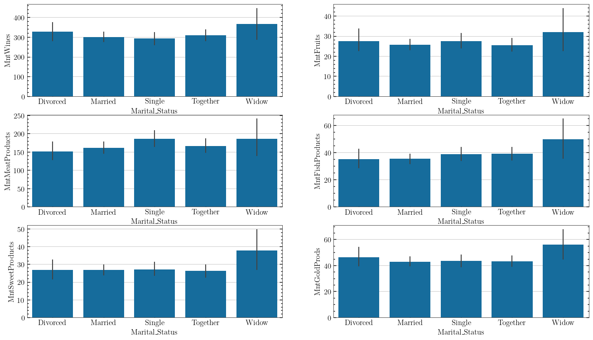
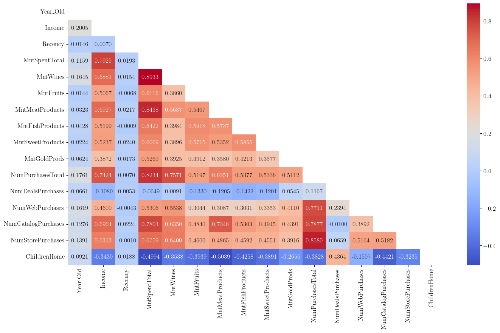
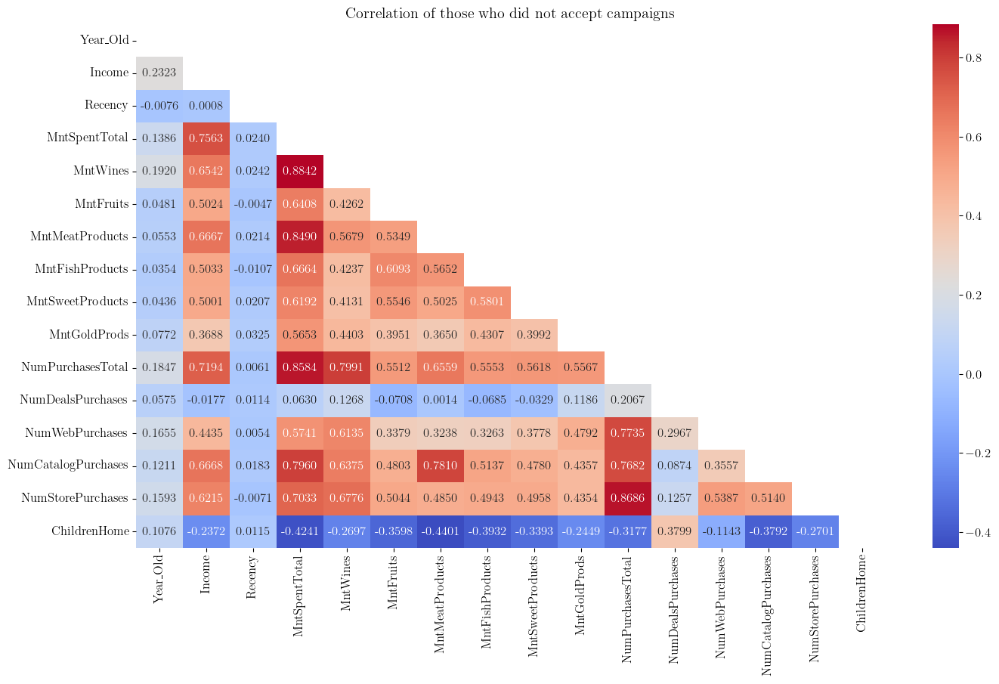
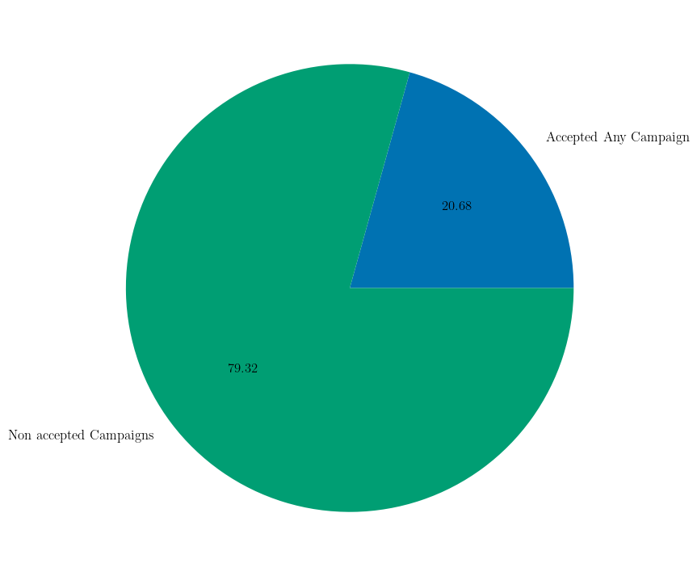

```{r setup, include=FALSE}
library(knitr)
library(rmdformats)
library(reticulate)

## Global options
options(max.print = "79")
knitr::opts_chunk$set(
  echo = TRUE, cache = FALSE, prompt = FALSE,
  tidy = FALSE, comment = NA,
  message = FALSE, warning = FALSE, fig.align = "center"
)
opts_knit$set(width = 90)
reticulate::use_python("U:/Users/alvar/miniforge3/envs/learning")
Sys.setenv(RETICULATE_PYTHON = "U:/Users/alvar/miniforge3/envs/learning")
knitr::knit_engines$set(python = reticulate::eng_python)

# Add to the exported html and put the tables inside:
# <div style="display:flex;justify-content:center;align-items:center;">

```

# Objectives {.unnumbered}

#### Basics: {.unnumbered}

Build an analysis to address the greatest benefit for the next direct marketing
campaign (sixth) that aims to sell a new direct marketing campaign (sixth) that
aims to sell a new gadget gadget. Pilot campaign:

-   2240 customers
-   Sample campaign cost: 6,720MU (million euros)
-   Revenue generated: 3,674MU
-   Overall profit: -3,046MU
-   Success rate 15%.

#### Advanced: {.unnumbered}

Develop a model that predicts customer behaviour and apply it to the rest of
the customer base to the rest of the customer base.

-   Select customers most likely to purchase the offer.
-   Exclude non-responders.
-   Characteristic traits of customers willing to buy the gadget.

# Data Cleaning

```{python, include=FALSE}
import json
import numpy as np
import pandas as pd
import matplotlib as mpl
import matplotlib.pyplot as plt
import seaborn as sns
import pingouin as pg
from pathlib import Path
from datetime import datetime
from scipy import stats
from scipy.stats import kstest
from IPython.display import display
from tabulate import tabulate

import psutil
import warnings
from sinfo import sinfo

warnings.filterwarnings("ignore")
plt.rcdefaults()

# Storing path
path = Path("../../data/ifood_customers.csv")

# Read CSV with pandas
data = pd.read_csv(path)

```

```{python, include=FALSE}
plt.style.use('seaborn-v0_8-colorblind')

```

First of all, the cleaning of data that may interfere with the analysis is
started by checking the columns of the dataset and selecting those whose type
is ‘object’ in order to see their unique values.

```{python}
# Exploring unique values in some columns

print("\n'Education' Column Values:\n", "\t",
      data["Education"].unique(),
      sep=''
      )

print("\n'Marital_Status' Column Values:\n", "\t",
      data["Marital_Status"].unique(),
      sep=''
      )

print("\n'Dt_Customer' Column sample:\n",
      data["Dt_Customer"].sample(3), "\n", "\t",
      sep=''
      )
```

Once we know what these columns are made up of, the type of column is changed
to the appropriate format, this being ‘category’ or ‘datetime’. In addition,
new columns are added to find out the age of the customers, how many days they
have been customers, whether they have made purchases in the last month, the
total amount they have spent, the total number of purchases, the total number
of campaigns accepted, and the total number of children they have at home.

Once these new columns have been found to be of interest for the following
analyses, they are reordered to make them easier to read.

```{python}

data["Income"] = data["Income"].astype("Int64")
data["Education"] = data["Education"].astype("category")
data["Marital_Status"] = data["Marital_Status"].astype("category")
data["Dt_Customer"] = pd.to_datetime(data["Dt_Customer"], format="%Y-%m-%d")

today = pd.to_datetime(datetime.today().strftime('%Y-%m-%d'))
data["Year_Old"] = (today.year - data["Year_Birth"])
data["CustomerFor"] = (today - data["Dt_Customer"])

# Reordering columns 1

pop_column = data.pop("Dt_Customer")
data.insert(2, "Dt_Customer", pop_column)

last_columns = data.columns[-2:]
first_columns = data.columns[:2]
middle_columns = data.columns[2:-2]
new_order = list(first_columns) + list(last_columns) + list(middle_columns)

data = data[new_order]

# Checking if the customer bought in the last month
data["PurchaseLastMonth"] = (data["Recency"] < 30)
data["PurchaseLastMonth"] = data["PurchaseLastMonth"].replace({True:1, 
                                                               False:0})
# Calculating total amount spent per customer
MntSpentTotal_sum = ["MntFishProducts", "MntFruits", "MntGoldProds", 
                     "MntMeatProducts", "MntSweetProducts", "MntWines"]
data["MntSpentTotal"] = data[MntSpentTotal_sum].sum(axis=1)

# How many campaigns the customer accepted
AcceptedCmpTotal_sum = ["AcceptedCmp1", "AcceptedCmp2", "AcceptedCmp3", 
                        "AcceptedCmp4", "AcceptedCmp5"]
data["AcceptedCmpTotal"] = data[AcceptedCmpTotal_sum].sum(axis=1)

# How many children (Kids and teenagers) the customer has at home

ChildrenHome_sum = ["Kidhome", "Teenhome"]
data["ChildrenHome"] = data[ChildrenHome_sum].sum(axis="columns")

NumPurchasesTotal_sum = ["NumWebPurchases", 
                         "NumCatalogPurchases", 
                         "NumStorePurchases"]

data["NumPurchasesTotal"] = data[NumPurchasesTotal_sum].sum(axis="columns")

# Reordering columns

pop_column = data.pop("AcceptedCmpTotal")
data.insert(27, "AcceptedCmpTotal", pop_column)

pop_column = data.pop("PurchaseLastMonth")
data.insert(17, "PurchaseLastMonth", pop_column)

pop_column = data.pop("MntSpentTotal")
data.insert(11, "MntSpentTotal", pop_column)

pop_column = data.pop("ChildrenHome")
data.insert(10, "ChildrenHome", pop_column)

pop_column = data.pop("AcceptedCmp2")
data.insert(25, "AcceptedCmp2", pop_column)

pop_column = data.pop("AcceptedCmp1")
data.insert(25, "AcceptedCmp1", pop_column)

pop_column = data.pop("Response")
data.insert(30, "Response", pop_column)

pop_column = data.pop("NumPurchasesTotal")
data.insert(20, "NumPurchasesTotal", pop_column)

data.info()

```

## Discarding client entries

Customers who are deemed not to meet the inclusion criteria for further
analysis will then be analysed and discarded. The exclusion criteria will be:
not having all fields completed and those clients who are considered to be
logically inconsistent in their answers.

First, missing values will be detected and the corresponding rows will be
discarded. Then those clients who have answered in Marital Status (which we
checked earlier) with ‘Alone, Absurd, or Yolo’ will be considered logically
inconsistent.

```{python, class.source = "fold-show"}

# Missing Values
row_nan = data[data.isna().any(axis=1)]
data.drop(row_nan.index, inplace=True)

# Identifying logically incoherent customers and dropping from the dataframe
marital_filt = data[data["Marital_Status"].isin(['Alone', 'Absurd', 'YOLO'])]
data.drop(marital_filt.index, inplace=True)
```

Next, outliers in the previously created variable of age and in ‘Income’ will
be identified. To do this, before starting the normality of both variables will
be checked with the Kolmogorov-Smirnov test, whose Null Hypothesis is that the
sample follows the normal distribution. It can be observed that in both cases
with our data H0 does not hold and it will be considered that they do not
follow the normal curve.

```{python, class.source = "fold-show"}

# KS-Test on 'Year_Old' column
ks_result = kstest(data["Year_Old"], stats.norm.cdf, 
                   args=(data["Year_Old"].mean(), data["Year_Old"].std()))

print(f"Test statistic: {ks_result.statistic:.4f}"
      f"\np Value: {ks_result.pvalue:.4f}")

# KS-Test on 'Year_Old' column
ks_result = kstest(data["Income"], stats.norm.cdf, 
                   args=(data["Income"].mean(), data["Income"].std()))

print(f"\nTest statistic: {ks_result.statistic:.4f}"
      f"\np Value: {ks_result.pvalue:.4f}")
```

Continue to obtain the outliers, which will be those extreme values according
to the interquartile range. For the variable ‘Year_Old’ three outliers will be
obtained, ages exceeding 120 years. For ‘Income’ 8 outliers are found, but only
one of them is considered logically incoherent. Three clients will be discarded
for age and one for ‘Income’.

```{python, class.source = 'foldable'}

# Quartiles and IQR
quartiles = data["Year_Old"].quantile([0.25, 0.75])
iqr = quartiles[0.75] - quartiles[0.25]

# Identify Outliers
lower_bound = quartiles[0.25] - 1.5 * iqr
upper_bound = quartiles[0.75] + 1.5 * iqr

# Filtering
Year_Old_outliers = data[(data["Year_Old"] < lower_bound) | 
                (data["Year_Old"] > upper_bound)]

temp = Year_Old_outliers[["ID", "Year_Old", "Income", "CustomerFor", 
                "Marital_Status", "MntSpentTotal"]]
headers = temp.columns
temp = tabulate(temp, headers, tablefmt="grid")
print("IQR: ", iqr,
      "\nYear_Old outliers: \n",
      temp, sep='')


# Extracting Outliers from the Dataset
data.drop(Year_Old_outliers.index, inplace=True)

# === #
# Quartiles and IQR
quartiles = data["Income"].quantile([0.25, 0.75])
iqr = quartiles[0.75] - quartiles[0.25]

# Identify Outliers
lower_bound = quartiles[0.25] - 1.5 * iqr
upper_bound = quartiles[0.75] + 1.5 * iqr

# Filtering
income_outliers = data[(data["Income"] < lower_bound) | 
                (data["Income"] > upper_bound)]

temp = income_outliers[["ID", "Year_Old", "Income", "CustomerFor", 
                "Marital_Status", "MntSpentTotal"]]\
                    .sort_values("Income", ascending=False)
headers = temp.columns
temp = tabulate(temp, headers, tablefmt="grid")
print("IQR: ", iqr,
      "\nYear_Old outliers: \n",
      temp, sep='')


# Extracting logically incoherent Outlier from the Dataset
income_excluded = data.drop(2233, inplace=True)
```

Finally, all excluded customer entries are stored in a single variable for
later export to a CSV file, so that no data will be lost if they are ever
needed.

```{python}

# Storing excluded entries

data_excluded = pd.concat([income_excluded, 
                          Year_Old_outliers, 
                          marital_filt, 
                          row_nan])

temp = data_excluded[["ID", "Year_Old", "Income", 
                      "Marital_Status", "MntSpentTotal"]]\
                      .sort_values("ID")
```

```{r}
library(kableExtra)

temp <- py$temp
# Generating Table
temp <- kable(temp, row.names = FALSE) %>%
  kable_styling(full_width = FALSE) %>%
  row_spec(0, bold = TRUE, color = "#ffffff", background = "#232629") %>%
  kable_styling(latex_options = "striped", 
                position = "center", 
                bootstrap_options = c("striped", "hover", "condensed"))

temp
```

## Creating categorical columns

Without outliers it is possible to continue creating categorical columns as now
an extreme value will not interfere with the intervals. Categories will be made
for ‘Year_Old’, ‘Income’, ‘MntSpentTotal’ and ‘Recency’.

```{python, class.source = "fold-show"}

# Age binning categories
bins = [25, 35, 45, 55, 65, 75, 2000]
labels = ["25_34", "35_44", "45_54", "55_64", "65_74", "75_above"]

data["Age_cat"] = pd.cut(data["Year_Old"], bins, labels=labels, right=False)

# Income binning categories
labels = [f"D{i+1}" for i in np.arange(0,10)]
data["Income_cat"] = pd.cut(data["Income"], 10, precision=0, labels=labels)

# Total amount spent binning categories
data["MntTotal_cat"], intervals = pd.cut(data["MntSpentTotal"], 6, 
                                         precision=0, retbins=True)

# Creating new, more descriptive bins
temp, first_int = pd.cut(np.arange(2, 426), 5, retbins=True)
bins = list(first_int) + list(intervals[2:])

data["MntTotal_cat"], intervals = pd.cut(data["MntSpentTotal"], bins, 
                                         precision=0, right=False, 
                                         retbins=True)

# Recency binning categories
labels = ["0_24", "25_49", "50_74", "75_99"]

data["Recency_cat"] = pd.cut(data["Recency"], 4, precision=0, labels=labels)

temp = data[["MntTotal_cat", "Age_cat", 
             "Income_cat", "Recency_cat"]].sample(5)

headers = temp.columns
temp = tabulate(temp, headers, tablefmt="grid")
print(temp)

```

Finally, duplicate clients will be checked for their ‘ID’ and data types will
be standardised to ‘Int64’ pandas.

```{python}

# Check duplicated customers
duplicated = data["ID"].duplicated().any()
print(f"There are duplicated customers based on 'ID' column?: {duplicated}")

# standardizing int dtype
for col in data.columns:
    if data[col].dtype == "int64":
        data[col] = data[col].astype("Int64")
```

When saving the dataset as a CSV, the dataset will be saved with the cleaned
data as ‘ifood_cleaned.csv’ and the discarded data as ‘ifood_excluded.csv’. It
will also be useful to store the column data types in a JSON to speed up the
process when the dataset needs to be imported again.

```{python, class.source = "fold-show"}
# Saving DataFrame as csv
data.to_csv("../../data/ifood_cleaned.csv", index=False)

# Saving dtypes of each column
data_dtypes = data.dtypes.to_frame('dtypes').reset_index()
dict = data_dtypes.set_index('index')['dtypes'].astype(str).to_dict()

with open('../../data/cleaned_dtypes.json', 'w') as f:
    json.dump(dict, f)

# Storing excluded rows
data.to_csv("../../data/ifood_excluded.csv", index=False)
```

# Descriptive Analysis

This section will summarise the descriptive analysis with the data considered
most interesting, the full analysis can be found in the notebook
‘02_descriptive.ipynb’ in the repository.

Dataset loading and formatting of categorical variables as the ‘dtype’ import
does not include the order in the categories:

```{python, include=FALSE}
# Storing path
path = Path("../../data/ifood_cleaned.csv")

# Read CSV with pandas
data = pd.read_csv(path)

# Read columns dtypes
with open('../../data/cleaned_dtypes.json', 'r') as f:
    data_types = json.load(f)
data = data.astype(data_types)

# Formatting
data["MntTotal_cat"], intervals = pd.cut(data["MntSpentTotal"], 6, 
                                         precision=0, retbins=True)

temp, first_int = pd.cut(np.arange(2, 426), 5, retbins=True)
bins = list(first_int) + list(intervals[2:])

data["MntTotal_cat"], intervals = pd.cut(data["MntSpentTotal"], bins, 
                                         precision=0, right=False, 
                                         retbins=True, ordered=True)

data["Recency_cat"] = data["Recency_cat"].cat.as_ordered()
data["Age_cat"] = data["Age_cat"].cat.as_ordered()

data["Education"] = data["Education"].cat.reorder_categories(["Basic", 
                                                              "Graduation", 
                                                              "2n Cycle", 
                                                              "Master", 
                                                              "PhD"], 
                                                              ordered=True)

data["Income_cat"] = data["Income_cat"].cat\
    .reorder_categories(['D1', 'D2', 'D3', 'D4', 'D5', 
                         'D6', 'D7', 'D10'], ordered=True)
```

## Categorical variables

The main interest would be in how many people accepted which campaigns in order
to take this into account in the next comparisons. It can be seen how, taking
into account the total sample, in each of the campaigns the level of acceptance
has been less than 10%, at most 7.44% in the fourth campaign.

```{python}
# Acceptance campaign groups
accp_cmp1 = data["AcceptedCmp1"].value_counts()
accp_cmp2 = data["AcceptedCmp2"].value_counts()
accp_cmp3 = data["AcceptedCmp3"].value_counts()
accp_cmp4 = data["AcceptedCmp4"].value_counts()
accp_cmp5 = data["AcceptedCmp5"].value_counts()

frec_abs = pd.concat([accp_cmp1, accp_cmp2, accp_cmp3, accp_cmp4, accp_cmp5],
                     keys=["AcceptedCmp1", "AcceptedCmp2", "AcceptedCmp3", 
                           "AcceptedCmp4", "AcceptedCmp5"])

frec_abs.index.names = ["Campaign", "Acceptance"]
frec_abs = pd.DataFrame(frec_abs)
frec_abs.columns = ["Frequencies"]

frec_rel = (frec_abs["Frequencies"] / len(data["ID"])).round(4)
frec_per = 100 * frec_rel

frec_tab = pd.concat([frec_abs, frec_rel, frec_per], axis=1,
                     keys=["Absolute", "Relative", "Percentage"])

frec_tab.columns.names = ["Frequencies", "drop"]
frec_tab = frec_tab.droplevel(level="drop", axis=1)

temp = frec_tab.reset_index()
temp_index = list(temp.index.values)

```

```{r}
library(kableExtra)
library(dplyr)

# Importing data from python
temp <- py$temp
temp_index = py$temp_index

# Creating Index
temp$'.' <- temp_index
temp <- temp %>%
  select('.', everything())

# Generating Table
temp <- kable(temp, row.names = FALSE) %>%
  kable_styling(full_width = FALSE) %>%
  row_spec(0, bold = TRUE, color = "#ffffff", background = "#232629") %>%
  kable_styling(latex_options = "striped", 
                position = "center", 
                bootstrap_options = c("striped", "hover", "condensed"))

temp

```

The following table shows the frequencies of the age category ‘Age_cat’,
showing that the majority of customers are aged 45 and over, with the category
45 to 55 having the highest number of customers, 33%.

```{python}
frec_abs = data["Age_cat"].value_counts().sort_index()
frec_abs_acc = data["Age_cat"].value_counts().sort_index().cumsum()

frec_rel = (frec_abs / len(data["Age_cat"])).round(4)
frec_rel_acc = (frec_abs / len(data["Age_cat"])).cumsum().round(4)

frec_per = 100 * frec_rel
frec_per_acc = (100 * frec_rel).cumsum()

frec_tab = pd.concat([frec_abs, frec_rel, frec_per], axis=1,
                     keys=["frec_abs", "frec_rel", "frec_per"])
frec_acc = pd.concat([frec_abs_acc, frec_rel_acc, frec_per_acc], axis=1,
                     keys=["frec_abs_acc", "frec_rel_acc", "frec_per_acc"])
frec_tab = pd.concat([frec_tab, frec_acc], axis=1)

temp = frec_tab
temp_index = list(temp.index.values)

```

```{r}
library(kableExtra)
library(dplyr)

# Importing data from python
temp <- py$temp
temp_index = py$temp_index

# Creating Index
temp$Age_cat <- temp_index
temp <- temp %>%
  select(Age_cat, everything())

# Generating Table
temp <- kable(temp, row.names = FALSE) %>%
  kable_styling(full_width = FALSE) %>%
  row_spec(0, bold = TRUE, color = "#ffffff", background = "#232629") %>%
  kable_styling(latex_options = "striped", 
                position = "center", 
                bootstrap_options = c("striped", "hover", "condensed"))

temp

```

To finish with the categorical variables, another one that might be of interest
is the level of study, shown below as a stacked bar chart showing the
percentage of clients with different studies. The bulk are graduates but we
should not underestimate PhD and Masters which between them also have a
significant number of clients.

```{python}
width = 0.2
label = "Education"
fig, ax = plt.subplots(figsize=(2,6))
bottom = np.zeros(1)

for boolean, values in frec_tab["frec_per"].items():
    p = ax.bar(label, values, width, label=boolean, bottom=bottom)
    bottom += values

ax.set_title("Percentage of Customer's Education")
ax.legend(loc="upper right")
ax.set_ylim(0,130);
plt.show();
```

## Quantitative variables

First, the distribution of the variables will be checked for normal
distribution by listing the quantitative columns and performing the
Kolgomorov-Smirnov test on all of them.

```{python, class.source = "fold-show"}
# KS-Test integer columns

int_cols = ["Year_Old", "Income", "Recency", "MntSpentTotal", "MntWines", 
            "MntFruits", "MntMeatProducts", "MntFishProducts",
            "MntSweetProducts", "MntGoldProds", "NumPurchasesTotal",
            "NumDealsPurchases", "NumWebPurchases", "NumCatalogPurchases", 
            "NumStorePurchases", "ChildrenHome"]

def ksfunc(col):
    return stats.kstest(col, stats.norm.cdf,
                        args=(col.mean(), col.std()))

results = data[int_cols].apply(ksfunc)

results = results.T
results = results.applymap(lambda x: f"{x:.4f}")
results.columns = ["Statistic", "p-Value"]
results.columns.names = ["KS-Test"]
results.index.names = ["int_cols"]

temp = results
temp_index = list(results.index.values)
```

```{r}
library(kableExtra)
library(dplyr)

# Importing data from python
temp <- py$temp
temp_index = py$temp_index

# Creating Index
temp$KS_test <- temp_index
temp <- temp %>%
  select(KS_test, everything())

# Generating Table
temp <- kable(temp, row.names = FALSE) %>%
  kable_styling(full_width = FALSE) %>%
  row_spec(0, bold = TRUE, color = "#ffffff", background = "#232629") %>%
  kable_styling(latex_options = "striped", 
                position = "center", 
                bootstrap_options = c("striped", "hover", "condensed"))

temp

```

To continue, it would be interesting to observe in the same table the
descriptive statistics for each variable, for which several functions will be
defined to obtain the range between the minimum and the maximum, to obtain the
coefficient of variation centred on the mean, and the trimmed mean as another
robust measure of central tendency. In addition, a class will be defined to
obtain the Winsorised Mean which is less robust than the trimmed mean and can
give us an idea of the central tendency of the variables. Finally, two new
columns will be generated in the results to help to see the dispersion of the
data, its symmetry, thanks to the values of skewness and kurtosis.

```{python, class.source = "fold-show"}
class WinsorizedMeanCalculator:
    def __init__(self, lower_percentile=0.05, upper_percentile=0.95):
        """
            Winsorized Mean (5%)
            ---
            Args:
                lower_percentile=0.05
                upper_percentile=0.95
            ---
            The k% winsorized mean is obtained by calculating the 
            arithmetic mean after replacing the k% of the smallest values 
            by the smallest value of the remaining values and the k% of the 
            largest values by the largest value of the remaining values.
        """
        self.lower_percentile = lower_percentile
        self.upper_percentile = upper_percentile

    def winsorize(self, data):
        lower_limit = np.percentile(data, self.lower_percentile * 100)
        upper_limit = np.percentile(data, self.upper_percentile * 100)

        # Replace extreme values with the adjacent limits
        data = np.where(data < lower_limit, lower_limit, data)
        data = np.where(data > upper_limit, upper_limit, data)

        return data

    def calcu_winsor_mean(self, column):
        winsorized_data = self.winsorize(column)
        return np.mean(winsorized_data)

winsor = WinsorizedMeanCalculator()


def range(col):
    return col.max() - col.min()

def cdv(col):
    """
        Coefficient of Variation Centered on the Mean.
        ---
        (std / mean) * 100
        ---
        Reasonable dispersion is associated with coefficients of variation 
        less than 50. Coefficients of variation greater than 50 indicate a 
        lot of dispersion. Coefficients greater than 100 are generally 
        indicative of strong anomalies in the data.
    """
    return (col.std() / abs(col.mean())) * 100

def trimean(series):
    """
        BESA (best easy systematic average)
        ---
        (Q1 + 2*Q2 + Q3) / 4
        ---
        Highly robust central tendency statistic
    """
    Q1 = series.quantile(0.25)
    median = series.median()
    Q3 = series.quantile(0.75)
    return (Q1 + 2 * median + Q3) / 4


```

```{python, class.source = "fold-show"}
results = data[int_cols].agg(["mean", "median", trimean, 
                              #stats.median_abs_deviation,
                              "std", cdv,
                              range, "min", "max"])

winsor_mean = data[int_cols].agg(winsor.calcu_winsor_mean)
skew = data[int_cols].agg(stats.skew, bias=False)
kurt = data[int_cols].agg(stats.kurtosis, bias=False)
skew_kurt = pd.concat([winsor_mean, skew, kurt], axis=1)
skew_kurt.columns = ["winsor_mean", "skew", "kurt"]

results = results.T

results = pd.concat([results, skew_kurt], axis=1)
results["skew/std"] = (results["skew"] / results["std"])
results["kurt/std"] = (results["kurt"] / results["std"])

#    If the result is between -2 and 2, the distribution can be assumed to 
#    be symmetric (or meso-kurtic); if it is greater than 2, the distribution 
#    can be said to be positively skewed (or leptokurtic); and if it is 
#    less than -2, the distribution can be said to be 
#    negatively skewed (or platykurtic).


results = results.map(lambda x: f"{x:.2f}")

results.columns.names = ["Descriptive Stats"]
results.index.names = ["int_cols"]

temp = results
temp_index = list(results.index.values)
```

```{r}
library(kableExtra)
library(dplyr)

# Importing data from python
temp <- py$temp
temp_index = py$temp_index

# Creating Index
temp$Columns <- temp_index
temp <- temp %>%
  select(Columns, everything())

# Generating Table
temp <- kable(temp, row.names = FALSE) %>%
  kable_styling(full_width = FALSE) %>%
  row_spec(0, bold = TRUE, color = "#ffffff", background = "#232629") %>%
  kable_styling(latex_options = "striped", 
                position = "center", 
                bootstrap_options = c("striped", "hover", "condensed"))

temp
```

If the above table with the descriptives is observed, it can be seen that the
six variables corresponding to the money spent by type of product are the ones
with the greatest dispersion. Also the asymmetry corresponding to the purchase
platform, whether web, in-store or catalogue, are the three variables with the
highest leptokurtic asymmetry.

As mentioned before, in the notebook is in greater detail the analysis, showing
a histogram with density line one of the variables mentioned.

Finally, taking into account the variable ‘MntSpentTotal’ the total amount of
money they have spent, will be shown in comparison with age groups and marital
status. Also, taking into account the marital status, bar charts will be
displayed for each type of product and its corresponding expenditure.

``` python
fig, ax =plt.subplots(3,2)

sns.barplot(ax=ax[0,0], x="Marital_Status", 
            y="MntWines", data=data);
sns.barplot(ax=ax[0,1], x="Marital_Status", 
            y="MntFruits", data=data);
sns.barplot(ax=ax[1,0], x="Marital_Status", 
            y="MntMeatProducts", data=data);
sns.barplot(ax=ax[1,1], x="Marital_Status", 
            y="MntFishProducts", data=data);
sns.barplot(ax=ax[2,0], x="Marital_Status", 
            y="MntSweetProducts", data=data);
sns.barplot(ax=ax[2,1], x="Marital_Status", 
            y="MntGoldProds", data=data);

plt.show()
```



The following two tables that will conclude the descriptive analysis section
show the descriptive statistics separating those who have accepted any campaign
(represented by `_y`) from those who have not accepted any (`_n`).

```{python}
spent_mnt = ["MntWines", "MntFruits", "MntMeatProducts", 
             "MntFishProducts", "MntSweetProducts", "MntGoldProds"]

dataycmp = data[data["AcceptedCmpTotal"] > 0]
datancmp = data[data["AcceptedCmpTotal"] == 0]

results_y = dataycmp[spent_mnt].agg(["mean", "median", "std", 
                                     cdv, "min", "max"])
results_n = datancmp[spent_mnt].agg(["mean", "median", "std", 
                                     cdv, "min", "max"])

temp = pd.merge(results_y.T, results_n.T, 
                on=results_y.columns, suffixes=["_y", "_n"])

temp.index = temp["key_0"]
temp = temp[['mean_y', 'mean_n', 'median_y', 'median_n', 'std_y', 'std_n', 
            'cdv_y', 'cdv_n', 'min_y', 'min_n', 'max_y', 'max_n']]
temp.index.names = ["Amount Spent"]
temp.columns.names = ["Results"]
temp = temp.map(lambda x: f"{x:.2f}")
temp_index = list(temp.index.values)
```

```{r}
library(kableExtra)
library(dplyr)

# Importing data from python
temp <- py$temp
temp_index = py$temp_index

# Creating Index
temp$Columns <- temp_index
temp <- temp %>%
  select(Columns, everything())

# Generating Table
temp <- kable(temp, row.names = FALSE) %>%
  kable_styling(full_width = FALSE) %>%
  row_spec(0, bold = TRUE, color = "#ffffff", background = "#232629") %>%
  kable_styling(latex_options = "striped", 
                position = "center", 
                bootstrap_options = c("striped", "hover", "condensed"))

temp

```

The table above shows how the averages for all types of products seem to be
higher in the group of people who accepted a campaign, and also thanks to the
value provided by the dispersion coefficient, there is less dispersion in their
data.

```{python}
numpurchases = ["NumPurchasesTotal", "NumWebPurchases", "NumStorePurchases",
                "NumCatalogPurchases", "NumDealsPurchases"]

results_y = dataycmp[numpurchases].agg(["mean", "median", "std", 
                                        cdv, "min", "max"])
results_n = datancmp[numpurchases].agg(["mean", "median", "std", 
                                        cdv, "min", "max"])

temp = pd.merge(results_y.T, results_n.T, 
                on=results_y.columns, suffixes=["_y", "_n"])

temp.index = temp["key_0"]
temp = temp[['mean_y', 'mean_n', 'median_y', 'median_n', 'std_y', 'std_n', 
            'cdv_y', 'cdv_n', 'min_y', 'min_n', 'max_y', 'max_n']]
temp.index.names = ["Purchases"]
temp.columns.names = ["Results"]
temp = temp.map(lambda x: f"{x:.2f}")
temp_index = list(temp.index.values)
```

```{r}
library(kableExtra)
library(dplyr)

# Importing data from python
temp <- py$temp
temp_index = py$temp_index

# Creating Index
temp$Columns <- temp_index
temp <- temp %>%
  select(Columns, everything())

# Generating Table
temp <- kable(temp, row.names = FALSE) %>%
  kable_styling(full_width = FALSE) %>%
  row_spec(0, bold = TRUE, color = "#ffffff", background = "#232629") %>%
  kable_styling(latex_options = "striped", 
                position = "center", 
                bootstrap_options = c("striped", "hover", "condensed"))

temp

```

Following the previous line, the average number of purchases is higher in those
who accepted a campaign but not in purchases with an offer, which seem to be
higher in the group that did not accept campaigns. Similarly, there is less
dispersion of the data in those who accepted campaigns.

# Inferential Analysis

Thanks to the inferential analysis that follows in this section, it will be
possible to observe relationships and comparisons of groups, mainly those who
accept offers with those who do not, in order to obtain a customer profile that
is interesting for the Marketing team and thus in the next campaign to obtain
more beneficial numbers.

```{python, include=FALSE}
class WinsorizedMeanCalculator:
    def __init__(self, lower_percentile=0.05, upper_percentile=0.95):
        """
            Winsorized Mean (5%)
            ---
            Args:
                lower_percentile=0.05
                upper_percentile=0.95
            ---
            The k% winsorized mean is obtained by calculating the 
            arithmetic mean after replacing the k% of the smallest values 
            by the smallest value of the remaining values and the k% of the 
            largest values by the largest value of the remaining values.
        """
        self.lower_percentile = lower_percentile
        self.upper_percentile = upper_percentile

    def winsorize(self, data):
        lower_limit = np.percentile(data, self.lower_percentile * 100)
        upper_limit = np.percentile(data, self.upper_percentile * 100)

        # Replace extreme values with the adjacent limits
        data = np.where(data < lower_limit, lower_limit, data)
        data = np.where(data > upper_limit, upper_limit, data)

        return data

    def calcu_winsor_mean(self, column):
        winsorized_data = self.winsorize(column)
        return np.mean(winsorized_data)

winsor = WinsorizedMeanCalculator()

def range(col):
    return col.max() - col.min()

def ksfunc(col):
    return stats.kstest(col, stats.norm.cdf,
                        args=(col.mean(), col.std()))

def cdv(col):
    """
        Coefficient of Variation Centered on the Mean.
        ---
        (std / mean) * 100
        ---
        Reasonable dispersion is associated with coefficients of variation 
        less than 50. Coefficients of variation greater than 50 indicate a 
        lot of dispersion. Coefficients greater than 100 are generally 
        indicative of strong anomalies in the data.
    """
    return (col.std() / abs(col.mean())) * 100

def trimean(series):
    """
        BESA (best easy systematic average)
        ---
        (Q1 + 2*Q2 + Q3) / 4
        ---
        Highly robust central tendency statistic
    """
    Q1 = series.quantile(0.25)
    median = series.median()
    Q3 = series.quantile(0.75)
    return (Q1 + 2 * median + Q3) / 4

# Storing path
path = Path("../../data/ifood_cleaned.csv")

# Read CSV with pandas
data = pd.read_csv(path)

# Read columns dtypes
with open('../../data/cleaned_dtypes.json', 'r') as f:
    data_types = json.load(f)

data = data.astype(data_types)

data["MntTotal_cat"], intervals = pd.cut(data["MntSpentTotal"], 6, 
                                         precision=0, retbins=True)

temp, first_int = pd.cut(np.arange(2, 426), 5, retbins=True)
bins = list(first_int) + list(intervals[2:])

data["MntTotal_cat"], intervals = pd.cut(data["MntSpentTotal"], bins, 
                                         precision=0, right=False, 
                                         retbins=True, ordered=True)

data["Recency_cat"] = data["Recency_cat"].cat.as_ordered()
data["Age_cat"] = data["Age_cat"].cat.as_ordered()

data["Education"] = data["Education"].cat.reorder_categories(["Basic", 
                                                              "Graduation", 
                                                              "2n Cycle", 
                                                              "Master", 
                                                              "PhD"], 
                                                              ordered=True)

data["Income_cat"] = data["Income_cat"].cat\
    .reorder_categories(['D1', 'D2', 'D3', 'D4', 'D5', 
                         'D6', 'D7', 'D10'], ordered=True)
                         
data_ycmp = data[data["AcceptedCmpTotal"] > 0]
data_ncmp = data[data["AcceptedCmpTotal"] == 0]
```

## Correlations

Three correlation matrices of the quantitative variables will be shown below
with heat maps for better visualisation, one for the whole dataset as a whole
and then two differentiating between those who did and did not accept a
campaign.

``` python
corr_matrix = data[int_cols].corr()
mask = np.triu(np.ones_like(corr_matrix, dtype = bool))
    
sns.heatmap(corr_matrix, cmap="coolwarm", annot=True, mask=mask, fmt=".4f")
plt.show()
```



``` python
corr_matrix = data_ycmp[int_cols].corr()
mask = np.triu(np.ones_like(corr_matrix, dtype = bool))

sns.heatmap(corr_matrix, cmap="coolwarm", annot=True, 
            mask=mask, fmt=".4f").set_title("Correlation of those "
                                            "who accepted campaigns")
plt.show()
```


``` python
corr_matrix = data_ncmp[int_cols].corr()
mask = np.triu(np.ones_like(corr_matrix, dtype = bool))

sns.heatmap(corr_matrix, cmap="coolwarm", annot=True, 
            mask=mask, fmt=".4f").set_title("Correlation of those who did "
                                            "not accept campaigns")
plt.show()
```



The strengths of the relationships are similar for all three correlation
matrices. A stronger relationship is observed between the income customers have
with the total spent as well as in the number of purchases made. It appears
that the highest number of purchases is related to those made directly in the
shop, with wine and meat being the most expensive, although in terms of money
spent it appears to be related to purchases through the catalogue. Offers are
then negatively related to those who have accepted a campaign, and offers are
also positively related to the children they have at home.

## Comparisons

First, the percentage of customers who accepted a campaign and those who did
not accept a campaign will be illustrated in a clear and simple way.

``` python
fig, ax = plt.subplots()
ax.pie([data_ycmp["ID"].count(), 
        data_ncmp["ID"].count()], 
        labels=["Accepted Any Campaign", "Non accepted Campaigns"],
        autopct='%1.2f%%',
        )
plt.show();
```



Before starting with the comparisons, the assumptions of normality and
homoscedasticity will be checked, thereby deciding on the most appropriate type
of test to perform the between-group comparisons.

```{python}
# KS-Test and Levene on integer columns by campaign acceptance

int_cols = ["Year_Old", "Income", "Recency", "MntSpentTotal", "MntWines", 
            "MntFruits", "MntMeatProducts", "MntFishProducts",
            "MntSweetProducts", "MntGoldProds", "NumPurchasesTotal",
            "NumDealsPurchases", "NumWebPurchases", "NumCatalogPurchases", 
            "NumStorePurchases", "ChildrenHome"]

# KS
def ksfunc(col):
    return stats.kstest(col, stats.norm.cdf,
                        args=(col.mean(), col.std()))

results_y = data_ycmp[int_cols].apply(ksfunc)
results_n = data_ncmp[int_cols].apply(ksfunc)

results_ks = pd.concat([results_n, results_y], )

results_ks = results_ks.T
results_ks = results_ks.applymap(lambda x: f"{x:.4f}")
results_ks.columns = ["Statistic (y)", "p-Value (y)", 
                      "Statistic (n)", "p-Value (n)"]
results_ks.columns.names = ["KS-Test"]
results_ks.index.names = ["int_cols"]

# Levene
results = stats.levene(data_ycmp[int_cols], 
                       data_ncmp[int_cols], 
                       center="mean")
results_stats = pd.Series(results.statistic)
results_stats.index = int_cols
results_pvalue = pd.Series(results.pvalue)
results_pvalue.index = int_cols

results_lev = pd.concat([results_stats, results_pvalue], axis=1)
results_lev.columns = ["Statistic", "p-Value"]
results_lev.columns.names = ["Levene"]
results_lev.index.names = ["int_cols"]

results_lev = results_lev.map(lambda x: f"{x:.4f}")

# Combining frames
results = pd.concat([results_ks, results_lev], axis=1)
column_names = [("Ks-test", "Statistic (y)"), ("Ks-test", "p-Value (y)"), 
                ("Ks-test", "Statistic (n)"), ("Ks-test", "p-Value (n)"),
                ("Levene", "Statistic"), ("Levene", "p-Value")]
results.columns = pd.MultiIndex.from_tuples(column_names)

temp = results
temp_index = list(temp.index.values)

```

```{r}
library(kableExtra)
library(dplyr)

# Importing data from python
temp <- py$temp
temp_index = py$temp_index

# Creating Index
temp$Columns <- temp_index
temp <- temp %>%
  select(Columns, everything())

# Generating Table
temp <- kable(temp, row.names = FALSE) %>%
  kable_styling(full_width = FALSE) %>%
  row_spec(0, bold = TRUE, color = "#ffffff", background = "#232629") %>%
  kable_styling(latex_options = "striped", 
                position = "center", 
                bootstrap_options = c("striped", "hover", "condensed"))

temp

```

### Parametric pairwise comparison

The T-test for independent samples will be performed on those columns where it
has been observed that the homoscedasticity assumption is met, being a large
sample (\>50) normality may not be met, but both assumptions cannot be violated
for this test. The Null Hypothesis of the T-test for independent samples is
equality in the means of the groups compared, therefore a *p* value of less
than 0.05 would indicate that the groups are not equal.

The comparison is whether there are differences between the means of the groups
that did or did not accept a campaign on the variables ‘Income’, ‘Recency’,
‘NumDealsPurchases’, ‘NumWebPurchases’, and ‘NumStorePurchases’. A *p* value of
less than 0.05 indicates that the group means are not equal. The effect size
was also tested with Cohen's *d* with the author's recommended cut-off points
of 0.20: small, 0.50: medium, 0.80: large [@cohen1992].

```{python}
cols_tt = ["Income", "Recency", "NumDealsPurchases", 
           "NumWebPurchases", "NumStorePurchases"]
           
for col in cols_tt:

    results_ks1 = stats.kstest(data_ycmp[col], stats.norm.cdf,
                            args=(data_ycmp[col].mean(), 
                                    data_ycmp[col].std()))
    results_ks2 = stats.kstest(data_ncmp[col], stats.norm.cdf,
                            args=(data_ncmp[col].mean(), 
                                    data_ncmp[col].std()))
    results_lev = stats.levene(data_ycmp[col], data_ncmp[col])
    ttest = stats.ttest_ind(data_ycmp[col], data_ncmp[col])
    cohend = (data_ycmp[col].mean() - data_ncmp[col].mean()) / data[col].std()

    print(
        f"\t{col} comparison\n"
        "\nAccepted Campaign Group: "
        f"\n\tMean: {data_ycmp[col].mean():.3f}"
        f"\n\tStd: {data_ycmp[col].std():.3f}"
        f"\n\tKS (p): {results_ks1.pvalue:.3f}"
        "\nnon-Accepted Campaign Group: "
        f"\n\tMean: {data_ncmp[col].mean():.3f}"
        f"\n\tStd: {data_ncmp[col].std():.3f}"
        f"\n\tKS (p): {results_ks1.pvalue:.3f}"
        f"\n\nLevene: {results_lev.pvalue:.3f}"
        "\nT-Test: "
        f"\n\tStatistic: {ttest.statistic:.3f}"
        f"\n\tp-value: {ttest.pvalue:.3f}"
        f"\nCohen's D: {cohend:.3f}"
        "\n\n\t======\n"
    )
```

To begin the comparisons, it is observed that 20.68% of the sample accepted
some campaign (out of the first 5 counted). It has been found in the sample
that Group_Y has higher revenues with medium effect strength reaching large
(d=0.778), and web and in-store purchases are also higher for Group_Y with
medium effect strength in both (d=0.5; d=0.4). Then, the number of offers
purchased is higher in Group_N although with a slight effect (d=0.2).

### Non-parametric pairwise comparison

For the remaining variables that do not meet the assumptions, the Mann-Whitney
U test, a robust test equivalent to the independent samples t-test, will be
used. Also the effect size will be measured this time with Wendt's formula for
the Biserial Range [@wendt1972] specific to the U-statistic. In this case the
strength of the effect will be 0.10: small, 0.30: medium, 0.50: large
[@coolican2013].

```{python}
cols_umw = ["Year_Old", "MntSpentTotal", "MntWines", 
            "MntFruits", "MntMeatProducts", "MntFishProducts",
            "MntSweetProducts", "MntGoldProds", "NumPurchasesTotal",
            "NumCatalogPurchases", "ChildrenHome"]
            
for col in cols_umw:

    results_ks1 = stats.kstest(data_ycmp[col], stats.norm.cdf,
                            args=(data_ycmp[col].mean(), 
                                    data_ycmp[col].std()))
    results_ks2 = stats.kstest(data_ncmp[col], stats.norm.cdf,
                            args=(data_ncmp[col].mean(), 
                                    data_ncmp[col].std()))
    results_lev = stats.levene(data_ycmp[col], 
                            data_ncmp[col])
    ttest = stats.mannwhitneyu(data_ycmp[col], 
                            data_ncmp[col],
                            use_continuity=True)
    
    # Rank-Biserial's Wendt formula
    n1, n2 = len(data_ycmp[col]), len(data_ncmp[col])
    rbis = 1 - (2 * ttest.statistic) / (n1 * n2)

    print(
        f"\t{col} comparison\n"
        "\nAccepted Campaign Group: "
        f"\n\tMedian: {data_ycmp[col].median():.3f}"
        f"\n\tStd: {data_ycmp[col].std():.3f}"
        f"\n\tKS (p): {results_ks1.pvalue:.3f}"
        "\nnon-Accepted Campaign Group: "
        f"\n\tMedian: {data_ncmp[col].median():.3f}"
        f"\n\tStd: {data_ncmp[col].std():.3f}"
        f"\n\tKS (p): {results_ks1.pvalue:.3f}"
        f"\n\nLevene: {results_lev.pvalue:.3f}"
        "\nMann-Whitney U test: "
        f"\n\tStatistic: {ttest.statistic:.3f}"
        f"\n\tp-value: {ttest.pvalue:.3f}"
        f"\nRank-Biserial r: {rbis:.3f}"
        "\n\n\t=====\n"
    )
```

In this group of comparisons between those who did not accept campaigns
(Group_N) and those who did (Group_Y), it can be seen that age is not a point
to take into account as there are no differences between the groups. Where
there is a difference is in the total spent and spent on wine, which Group_Y
outperforms with a large effect (rbis=0.5; rbis=0.56). On the meat and gold
products side, Group_Y is also superior with a medium effect (rbis=0.3;
rbis=0.3). In the number of total purchases as well as the number of catalogue
purchases, contrary to the relationships, the groups differ and Group_Y is
higher with a medium effect (rbis=0.4; rbis=0.49). Finally, those who did not
accept any campaign are observed to have more children than the other group
with a medium effect (rbis=0.298).

```{python}
result_mwu = pg.pairwise_tests(data=data, dv="MntSpentTotal", 
                               between="Response", parametric=False, 
                               alpha=0.05,)

# Rank-Biserial's Wendt formula
n1, n2 = len(data[data["Response"] == 0]), len(data[data["Response"] == 1])
rbis = 1 - (2 * result_mwu["U-val"]) / (n1 * n2)

result_mwu = pd.concat([result_mwu, rbis], axis=1)
result_mwu.columns = result_mwu.columns[:-1].tolist() + ["rbis"]

print("MntSpentTotal mean in last campaign with no Acceptance:\n"
      f"\t{data[data["Response"] == 0]["MntSpentTotal"].mean():.4f}")
print("MntSpentTotal mean in last campaign with Acceptance:\n"
      f"\t{data[data["Response"] == 1]["MntSpentTotal"].mean():.4f}\n")
print("MntSpentTotal std in last campaign with no Acceptance:\n"
      f"\t{data[data["Response"] == 0]["MntSpentTotal"].std():.4f}")
print("MntSpentTotal std in last campaign with Acceptance:\n"
      f"\t{data[data["Response"] == 1]["MntSpentTotal"].std():.4f}\n")
temp = result_mwu
temp_index = list(temp.index.values)
```

```{r}
library(kableExtra)
library(dplyr)

# Importing data from python
temp <- py$temp
temp_index = py$temp_index

# Creating Index
temp$'.' <- temp_index
temp <- temp %>%
  select('.', everything())

# Generating Table
temp <- kable(temp, row.names = FALSE) %>%
  kable_styling(full_width = FALSE) %>%
  row_spec(0, bold = TRUE, color = "#ffffff", background = "#232629") %>%
  kable_styling(latex_options = "striped", 
                position = "center", 
                bootstrap_options = c("striped", "hover", "condensed"))

temp

```

In this last pairwise comparison, it can be seen that in the last campaign
(sixth) the people who accepted the campaign are the ones who spend the most,
results that are consistent with the previous comparisons.

### Multiple comparison

In the case of comparisons of more than 2 groups, since the ANOVA test cannot
be performed due to non-compliance with assumptions, the alternative will be
the Kruskal Wallis H test. In the case of significant group comparisons, the
Games Howell *post-hoc* test will perform all possible pairwise comparisons and
we will obtain the strength of the effect of each comparison with Eta-square,
with cut-off points at 0.04: minimum necessary, 0.25: moderate, 0.64: strong
[@ferguson2009].

```{python, class.source = "fold-show"}
data["cmp_accp"] = np.where(data["AcceptedCmpTotal"] > 0, 1, 0)
```

Starting with the groups where no differences between their categories have been
found, there are ‘Recency’, ‘Recency_cat’ and ‘Marital_Status’.

```{python, class.source = "fold-show"}
result_kw1 = pg.kruskal(data=data, 
                       dv="MntSpentTotal", 
                       between="Recency_cat")


result_kw3 = pg.kruskal(data=data, 
                       dv="MntSpentTotal", 
                       between="Marital_Status")
                       

result_kw2 = pg.kruskal(data=data, 
                       dv="Recency", 
                       between="AcceptedCmpTotal")

result_kw = pd.concat([result_kw1, result_kw3, result_kw2])

headers = result_kw.columns
result_kw = tabulate(result_kw, headers, tablefmt="grid")
print("MntSpentTotal on Recency_cat and Marital_Status; " 
    "Also Recency on AcceptedCmpTotal:\n",
    result_kw, sep='')

```

The following comparisons will be around how many campaigns customers have
accepted, ranging from 0 to 4, on different variables.

```{python}
result_kw = pg.kruskal(data=data, 
                       dv="NumStorePurchases", 
                       between="AcceptedCmpTotal")

result_pair = pg.pairwise_gameshowell(data=data, 
                                      dv="NumStorePurchases", 
                                      between="AcceptedCmpTotal",
                                      effsize="eta-square")

result_kw = round(result_kw, 4)
result_pair = round(result_pair, 4)

headers = result_kw.columns
result_kw = tabulate(result_kw, headers, tablefmt="grid")
print("NumStorePurchases on AcceptedCmpTotal: \n",result_kw, sep='')

temp = result_pair
temp_index = list(temp.index.values)
```

```{r}
library(kableExtra)
library(dplyr)

# Importing data from python
temp <- py$temp
temp_index = py$temp_index

# Creating Index
temp$'.' <- temp_index
temp <- temp %>%
  select('.', everything())

# Generating Table
temp <- kable(temp, row.names = FALSE) %>%
  kable_styling(full_width = FALSE) %>%
  row_spec(0, bold = TRUE, color = "#ffffff", background = "#232629") %>%
  kable_styling(latex_options = "striped", 
                position = "center", 
                bootstrap_options = c("striped", "hover", "condensed"))

temp

```

```{python}
result_kw = pg.kruskal(data=data, 
                       dv="NumWebPurchases", 
                       between="AcceptedCmpTotal")

result_pair = pg.pairwise_gameshowell(data=data, 
                                      dv="NumWebPurchases", 
                                      between="AcceptedCmpTotal",
                                      effsize="eta-square")

result_kw = round(result_kw, 4)
result_pair = round(result_pair, 4)

headers = result_kw.columns
result_kw = tabulate(result_kw, headers, tablefmt="grid")
print("NumWebPurchases on AcceptedCmpTotal: \n",result_kw, sep='')

temp = result_pair
temp_index = list(temp.index.values)
```

```{r}
library(kableExtra)
library(dplyr)

# Importing data from python
temp <- py$temp
temp_index = py$temp_index

# Creating Index
temp$'.' <- temp_index
temp <- temp %>%
  select('.', everything())

# Generating Table
temp <- kable(temp, row.names = FALSE) %>%
  kable_styling(full_width = FALSE) %>%
  row_spec(0, bold = TRUE, color = "#ffffff", background = "#232629") %>%
  kable_styling(latex_options = "striped", 
                position = "center", 
                bootstrap_options = c("striped", "hover", "condensed"))

temp

```

```{python}
result_kw = pg.kruskal(data=data, 
                       dv="NumCatalogPurchases", 
                       between="AcceptedCmpTotal")

result_pair = pg.pairwise_gameshowell(data=data, 
                                      dv="NumCatalogPurchases", 
                                      between="AcceptedCmpTotal",
                                      effsize="eta-square")

result_kw = round(result_kw, 4)
result_pair = round(result_pair, 4)

headers = result_kw.columns
result_kw = tabulate(result_kw, headers, tablefmt="grid")
print("NumCatalogPurchases on AcceptedCmpTotal: \n",result_kw, sep='')

temp = result_pair
temp_index = list(temp.index.values)


```

```{r}
library(kableExtra)
library(dplyr)

# Importing data from python
temp <- py$temp
temp_index = py$temp_index

# Creating Index
temp$'.' <- temp_index
temp <- temp %>%
  select('.', everything())

# Generating Table
temp <- kable(temp, row.names = FALSE) %>%
  kable_styling(full_width = FALSE) %>%
  row_spec(0, bold = TRUE, color = "#ffffff", background = "#232629") %>%
  kable_styling(latex_options = "striped", 
                position = "center", 
                bootstrap_options = c("striped", "hover", "condensed"))

temp

```

```{python}
result_kw = pg.kruskal(data=data, 
                       dv="MntSpentTotal", 
                       between="AcceptedCmpTotal")

result_pair = pg.pairwise_gameshowell(data=data, 
                                      dv="MntSpentTotal", 
                                      between="AcceptedCmpTotal",
                                      effsize="eta-square")

result_kw = round(result_kw, 4)
result_pair = round(result_pair, 4)

headers = result_kw.columns
result_kw = tabulate(result_kw, headers, tablefmt="grid")
print("MntSpentTotal on AcceptedCmpTotal: \n",result_kw, sep='')

temp = result_pair
temp_index = list(temp.index.values)

```

```{r}
library(kableExtra)
library(dplyr)

# Importing data from python
temp <- py$temp
temp_index = py$temp_index

# Creating Index
temp$'.' <- temp_index
temp <- temp %>%
  select('.', everything())

# Generating Table
temp <- kable(temp, row.names = FALSE) %>%
  kable_styling(full_width = FALSE) %>%
  row_spec(0, bold = TRUE, color = "#ffffff", background = "#232629") %>%
  kable_styling(latex_options = "striped", 
                position = "center", 
                bootstrap_options = c("striped", "hover", "condensed"))

temp

```

Comparing in more detail the customers according to the number of campaigns
accepted, it could be reiterated that among those who have accepted 1 to 4
campaigns the differences are either not significant, or if they are
significant the strength of the effect is minimal. But the differences between
those who accepted any campaign and those who did not take up any campaign are
significant. The results are similar to the pairwise comparisons of the general
group who accepted any campaign with those who did not, for more detail on all
possible comparisons, the tables above may be helpful.

# Conclusions

#### Basics: {.unnumbered}

Starting with the relationships, it is generally observed that those with
higher incomes spend the most. It can also be seen that customers spend the
most on wine and meat products, in general buying through the catalogue. If we
focus on those people who have accepted a campaign (Group_Y onwards), the more
children they have at home, the less they consume, with the exception of offers
whose relationship is higher than that of the group of people who did not
accept campaigns (Group_N) (r=0.65; r=0.38). 

It might be appropriate to focus the selection of customers for future campaigns on those with higher incomes (therefore, those who spend more) and who buy online. Also, if the subject of the campaign is wine, there could be more loyal customers from previous campaigns who would be encouraged to repeat. It would be possible to attract the attention of people who do not usually accept campaigns if the campaign is oriented towards children or related products. 

# References
