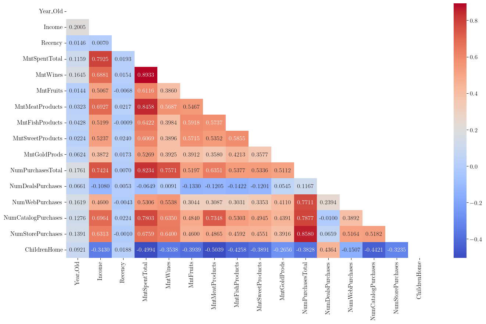
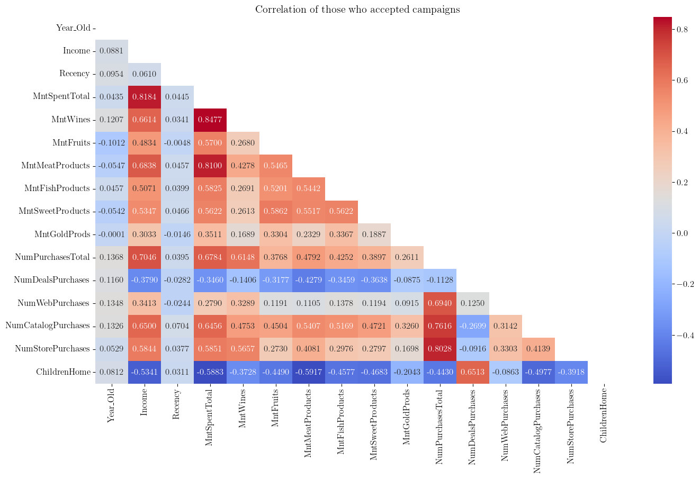
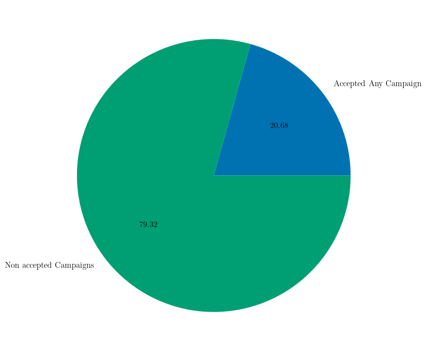

```{r setup, include=FALSE}
library(knitr)
library(rmdformats)
library(reticulate)

## Global options
options(max.print = "90")
knitr::opts_chunk$set(
  echo = TRUE, cache = FALSE, prompt = FALSE,
  tidy = FALSE, comment = NA,
  message = FALSE, warning = FALSE, fig.align = "center"
)
opts_knit$set(width = 90)
reticulate::use_python("U:/Users/alvar/miniforge3/envs/learning")
Sys.setenv(RETICULATE_PYTHON = "U:/Users/alvar/miniforge3/envs/learning")
knitr::knit_engines$set(python = reticulate::eng_python)

# Add to the exported html and put the tables inside:
# <div style="display:flex;justify-content:center;align-items:center;">

```

# Objetivos {.unnumbered}

#### Basicos: {.unnumbered}

Construir un análisis para abordar el mayor beneficio para la próxima campaña
de marketing directo (sexta) que tiene como objetivo la venta de un nuevo
gadget. Campaña piloto:

-   2240 clientes
-   Coste de la campaña de muestra: 6.720MU (millones de euros)
-   Ingresos generados: 3.674MU
-   Beneficio global:
-   3.046MU
-   Éxito: 15%

#### Avanzados: {.unnumbered}

Desarrollar un modelo que prediga el comportamiento de los clientes y aplicarlo
al resto de la base de clientes.

-   Seleccionar a los clientes con más probabilidades de adquirir la oferta.
-   Dejar fuera a los que no responden.
-   Rasgos característicos de los clientes dispuestos a comprar el gadget. 

# Data Cleaning

```{python, include=FALSE}
import json
import numpy as np
import pandas as pd
import matplotlib as mpl
import matplotlib.pyplot as plt
import seaborn as sns
import pingouin as pg
from pathlib import Path
from datetime import datetime
from scipy import stats
from scipy.stats import kstest
from IPython.display import display
from tabulate import tabulate

import psutil
import warnings
from sinfo import sinfo

warnings.filterwarnings("ignore")
plt.rcdefaults()

# Storing path
path = Path("../../data/ifood_customers.csv")

# Read CSV with pandas
data = pd.read_csv(path)

```

```{python, include=FALSE}
plt.style.use('seaborn-v0_8-colorblind')

```

En un primer momento se comienza la limpieza de los datos que puedan interferir
los análisis comprobando las columnas del dataset y seleccionando aquellas que
el tipo sea 'objeto' para ver sus valores únicos.

```{python}
# Exploring unique values in some columns

print("\n'Education' Column Values:\n", "\t",
      data["Education"].unique(),
      sep=''
      )

print("\n'Marital_Status' Column Values:\n", "\t",
      data["Marital_Status"].unique(),
      sep=''
      )

print("\n'Dt_Customer' Column sample:\n",
      data["Dt_Customer"].sample(3), "\n", "\t",
      sep=''
      )
```

Una vez sabiendo de qué se componen estas columnas se cambia el tipo de la
columna al formato adecuando, siendo este 'category' o 'datetime'. Además, se
añaden nuevas columnas para saber la edad de los clientes, cuantos días llevan
siendo clientes, si han realizado compras en el último mes, la suma total de lo
que han gastado, suma del numero total de compras, la suma de las campañas
aceptadas, y la suma de los hijos/as que tienen en casa.

Una vez con estas columnas nuevas que son las que se han considerado con
interés para los siguientes análisis, se reordenan para mejorar su facilidad de
lectura.

```{python}

data["Income"] = data["Income"].astype("Int64")
data["Education"] = data["Education"].astype("category")
data["Marital_Status"] = data["Marital_Status"].astype("category")
data["Dt_Customer"] = pd.to_datetime(data["Dt_Customer"], format="%Y-%m-%d")

today = pd.to_datetime(datetime.today().strftime('%Y-%m-%d'))
data["Year_Old"] = (today.year - data["Year_Birth"])
data["CustomerFor"] = (today - data["Dt_Customer"])

# Reordering columns 1

pop_column = data.pop("Dt_Customer")
data.insert(2, "Dt_Customer", pop_column)

last_columns = data.columns[-2:]
first_columns = data.columns[:2]
middle_columns = data.columns[2:-2]
new_order = list(first_columns) + list(last_columns) + list(middle_columns)

data = data[new_order]

# Checking if the customer bought in the last month
data["PurchaseLastMonth"] = (data["Recency"] < 30)
data["PurchaseLastMonth"] = data["PurchaseLastMonth"].replace({True:1, 
                                                               False:0})
# Calculating total amount spent per customer
MntSpentTotal_sum = ["MntFishProducts", "MntFruits", "MntGoldProds", 
                     "MntMeatProducts", "MntSweetProducts", "MntWines"]
data["MntSpentTotal"] = data[MntSpentTotal_sum].sum(axis=1)

# How many campaigns the customer accepted
AcceptedCmpTotal_sum = ["AcceptedCmp1", "AcceptedCmp2", "AcceptedCmp3", 
                        "AcceptedCmp4", "AcceptedCmp5"]
data["AcceptedCmpTotal"] = data[AcceptedCmpTotal_sum].sum(axis=1)

# How many children (Kids and teenagers) the customer has at home

ChildrenHome_sum = ["Kidhome", "Teenhome"]
data["ChildrenHome"] = data[ChildrenHome_sum].sum(axis="columns")

NumPurchasesTotal_sum = ["NumWebPurchases", 
                         "NumCatalogPurchases", 
                         "NumStorePurchases"]

data["NumPurchasesTotal"] = data[NumPurchasesTotal_sum].sum(axis="columns")

# Reordering columns

pop_column = data.pop("AcceptedCmpTotal")
data.insert(27, "AcceptedCmpTotal", pop_column)

pop_column = data.pop("PurchaseLastMonth")
data.insert(17, "PurchaseLastMonth", pop_column)

pop_column = data.pop("MntSpentTotal")
data.insert(11, "MntSpentTotal", pop_column)

pop_column = data.pop("ChildrenHome")
data.insert(10, "ChildrenHome", pop_column)

pop_column = data.pop("AcceptedCmp2")
data.insert(25, "AcceptedCmp2", pop_column)

pop_column = data.pop("AcceptedCmp1")
data.insert(25, "AcceptedCmp1", pop_column)

pop_column = data.pop("Response")
data.insert(30, "Response", pop_column)

pop_column = data.pop("NumPurchasesTotal")
data.insert(20, "NumPurchasesTotal", pop_column)

data.info()

```

## Descartando entradas de clientes

A continuación se analizará y descartarán aquellos clientes que se considere
que no cumplen con los criterios de inclusión para el posterior análisis. Los
criterios de exclusión serán: no tener todos los campos completos y aquellos
clientes que se consideren lógicamente incoherentes en sus respuestas.

Primero se detectarán los valores faltantes y las filas correspondientes se
descartarán. A continuación consideraremos lógicamente incoherentes aquellos
clientes que hayan respondido en Estado Marital (que comprobamos anteriormente)
con "Alone, Absurd, o Yolo".

```{python, class.source = "fold-show"}

# Missing Values
row_nan = data[data.isna().any(axis=1)]
data.drop(row_nan.index, inplace=True)

# Identifying logically incoherent customers and dropping from the dataframe
marital_filt = data[data["Marital_Status"].isin(['Alone', 'Absurd', 'YOLO'])]
data.drop(marital_filt.index, inplace=True)
```

Seguidamente se identificarán los valores atípicos en la variable creada
anteriormente de edad y en 'Income'. Para ello, antes de empezar se comprobará
la normalidad de ambas variables con la prueba de Kolmogorov-Smirnov que tiene
como Hipótesis Nula que la muestra sigue la distribución normal. Se puede
observar que en ambos casos con nuestros datos no se mantiene H0 y se
considerará que no siguen la curva normal.

```{python, class.source = "fold-show"}

# KS-Test on 'Year_Old' column
ks_result = kstest(data["Year_Old"], stats.norm.cdf, 
                   args=(data["Year_Old"].mean(), data["Year_Old"].std()))

print(f"Test statistic: {ks_result.statistic:.4f}"
      f"\np Value: {ks_result.pvalue:.4f}")

# KS-Test on 'Year_Old' column
ks_result = kstest(data["Income"], stats.norm.cdf, 
                   args=(data["Income"].mean(), data["Income"].std()))

print(f"\nTest statistic: {ks_result.statistic:.4f}"
      f"\np Value: {ks_result.pvalue:.4f}")
```

Continuaremos obteniendo los valores atípicos, que serán aquellos valores
extremos según el rango intercuartil. Para la variable 'Year_Old' se obtendrán
tres valores atípicos, edades que superan los 120 años. Para 'Income' se
encuentran 8 valores atípicos, pero únicamente uno de ellos se considera
lógicamente incoherente. Se descartarán tres clientes por la edad y uno por
'Income'.

```{python, class.source = 'foldable'}

# Quartiles and IQR
quartiles = data["Year_Old"].quantile([0.25, 0.75])
iqr = quartiles[0.75] - quartiles[0.25]

# Identify Outliers
lower_bound = quartiles[0.25] - 1.5 * iqr
upper_bound = quartiles[0.75] + 1.5 * iqr

# Filtering
Year_Old_outliers = data[(data["Year_Old"] < lower_bound) | 
                (data["Year_Old"] > upper_bound)]

temp = Year_Old_outliers[["ID", "Year_Old", "Income", "CustomerFor", 
                "Marital_Status", "MntSpentTotal"]]
headers = temp.columns
temp = tabulate(temp, headers, tablefmt="grid")
print("IQR: ", iqr,
      "\nYear_Old outliers: \n",
      temp, sep='')


# Extracting Outliers from the Dataset
data.drop(Year_Old_outliers.index, inplace=True)

# === #
# Quartiles and IQR
quartiles = data["Income"].quantile([0.25, 0.75])
iqr = quartiles[0.75] - quartiles[0.25]

# Identify Outliers
lower_bound = quartiles[0.25] - 1.5 * iqr
upper_bound = quartiles[0.75] + 1.5 * iqr

# Filtering
income_outliers = data[(data["Income"] < lower_bound) | 
                (data["Income"] > upper_bound)]

temp = income_outliers[["ID", "Year_Old", "Income", "CustomerFor", 
                "Marital_Status", "MntSpentTotal"]]\
                    .sort_values("Income", ascending=False)
headers = temp.columns
temp = tabulate(temp, headers, tablefmt="grid")
print("IQR: ", iqr,
      "\nYear_Old outliers: \n",
      temp, sep='')


# Extracting logically incoherent Outlier from the Dataset
income_excluded = data.drop(2233, inplace=True)
```

Por último, almacenamos todas las entradas de clientes excluidos en una única
variable para su posterior exportación a un fichero CSV, con ello no se
perderán datos si en alguna ocasión se necesitaran.

```{python}

# Storing excluded entries

data_excluded = pd.concat([income_excluded, 
                          Year_Old_outliers, 
                          marital_filt, 
                          row_nan])

temp = data_excluded[["ID", "Year_Old", "Income", 
                      "Marital_Status", "MntSpentTotal"]]\
                      .sort_values("ID")
```

```{r}
library(kableExtra)

temp <- py$temp

# Generating Table
temp <- kable(temp, row.names = FALSE) %>%
  kable_styling(full_width = FALSE) %>%
  row_spec(0, bold = TRUE, color = "#ffffff", background = "#232629") %>%
  kable_styling(latex_options = "striped", 
                position = "center", 
                bootstrap_options = c("striped", "hover", "condensed"))

temp
```

## Creando columnas categoriales

Sin datos atípicos se puede continuar creando columnas categoriales ya que
ahora un valor extremos no interferirá en los intervalos. Se harán categorías
para 'Year_Old', 'Income', 'MntSpentTotal' y 'Recency'.

```{python, class.source = "fold-show"}

# Age binning categories
bins = [25, 35, 45, 55, 65, 75, 2000]
labels = ["25_34", "35_44", "45_54", "55_64", "65_74", "75_above"]

data["Age_cat"] = pd.cut(data["Year_Old"], bins, labels=labels, right=False)

# Income binning categories
labels = [f"D{i+1}" for i in np.arange(0,10)]
data["Income_cat"] = pd.cut(data["Income"], 10, precision=0, labels=labels)

# Total amount spent binning categories
data["MntTotal_cat"], intervals = pd.cut(data["MntSpentTotal"], 6, 
                                         precision=0, retbins=True)

# Creating new, more descriptive bins
temp, first_int = pd.cut(np.arange(2, 426), 5, retbins=True)
bins = list(first_int) + list(intervals[2:])

data["MntTotal_cat"], intervals = pd.cut(data["MntSpentTotal"], bins, 
                                         precision=0, right=False, 
                                         retbins=True)

# Recency binning categories
labels = ["0_24", "25_49", "50_74", "75_99"]

data["Recency_cat"] = pd.cut(data["Recency"], 4, precision=0, labels=labels)

temp = data[["MntTotal_cat", "Age_cat", 
             "Income_cat", "Recency_cat"]].sample(5)

headers = temp.columns
temp = tabulate(temp, headers, tablefmt="grid")
print(temp)

```

Por último, se comprobará si hay clientes duplicados por su 'ID' y se
estandarizarán los tipos de datos a pandas 'Int64'.

```{python}

# Check duplicated customers
duplicated = data["ID"].duplicated().any()
print(f"There are duplicated customers based on 'ID' column?: {duplicated}")

# standardizing int dtype
for col in data.columns:
    if data[col].dtype == "int64":
        data[col] = data[col].astype("Int64")
```

En el momento de guardar los dataset como CSV, se guardará el dataset con los
datos limpios como 'ifood_cleaned.csv' y los descartados como
'ifood_excluded.csv'. Así mismo, será de utilidad almacenar los tipos de datos
de las columnas en un JSON para agilizar el proceso cuando se requiera importar
el dataset de nuevo.

```{python, class.source = "fold-show"}
# Saving DataFrame as csv
data.to_csv("../../data/ifood_cleaned.csv", index=False)

# Saving dtypes of each column
data_dtypes = data.dtypes.to_frame('dtypes').reset_index()
dict = data_dtypes.set_index('index')['dtypes'].astype(str).to_dict()

with open('../../data/cleaned_dtypes.json', 'w') as f:
    json.dump(dict, f)

# Storing excluded rows
data.to_csv("../../data/ifood_excluded.csv", index=False)
```

# Análisis Descriptivo

En este apartado se resumirá el análisis descriptivo con los datos que se
consideren más interesantes, el análisis completo se puede encontrar en el
notebook '02_descriptive.ipynb' del repositorio.

Carga de dataset y formateo de variables categóricas ya que la importación de
los 'dtype' no incluye el orden en las categorías:

```{python, include=FALSE}
# Storing path
path = Path("../../data/ifood_cleaned.csv")

# Read CSV with pandas
data = pd.read_csv(path)

# Read columns dtypes
with open('../../data/cleaned_dtypes.json', 'r') as f:
    data_types = json.load(f)
data = data.astype(data_types)

# Formatting
data["MntTotal_cat"], intervals = pd.cut(data["MntSpentTotal"], 6, 
                                         precision=0, retbins=True)

temp, first_int = pd.cut(np.arange(2, 426), 5, retbins=True)
bins = list(first_int) + list(intervals[2:])

data["MntTotal_cat"], intervals = pd.cut(data["MntSpentTotal"], bins, 
                                         precision=0, right=False, 
                                         retbins=True, ordered=True)

data["Recency_cat"] = data["Recency_cat"].cat.as_ordered()
data["Age_cat"] = data["Age_cat"].cat.as_ordered()

data["Education"] = data["Education"].cat.reorder_categories(["Basic", 
                                                              "Graduation", 
                                                              "2n Cycle", 
                                                              "Master", 
                                                              "PhD"], 
                                                              ordered=True)

data["Income_cat"] = data["Income_cat"].cat\
    .reorder_categories(['D1', 'D2', 'D3', 'D4', 'D5', 
                         'D6', 'D7', 'D10'], ordered=True)
```

## Variables categóricas

El mayor interés sería en cuantas personas aceptaron qué campañas para tenerlo
en cuenta en las próximas comparaciones. Se puede observar como, teniendo en
cuenta la muestra total, en cada una de las campañas el nivel de aceptación ha
sido menor al 10%, cómo máximo un 7.44% en la cuarta campaña.

```{python}
# Acceptance campaign groups
accp_cmp1 = data["AcceptedCmp1"].value_counts()
accp_cmp2 = data["AcceptedCmp2"].value_counts()
accp_cmp3 = data["AcceptedCmp3"].value_counts()
accp_cmp4 = data["AcceptedCmp4"].value_counts()
accp_cmp5 = data["AcceptedCmp5"].value_counts()

frec_abs = pd.concat([accp_cmp1, accp_cmp2, accp_cmp3, accp_cmp4, accp_cmp5],
                     keys=["AcceptedCmp1", "AcceptedCmp2", "AcceptedCmp3", 
                           "AcceptedCmp4", "AcceptedCmp5"])

frec_abs.index.names = ["Campaign", "Acceptance"]
frec_abs = pd.DataFrame(frec_abs)
frec_abs.columns = ["Frequencies"]

frec_rel = (frec_abs["Frequencies"] / len(data["ID"])).round(4)
frec_per = 100 * frec_rel

frec_tab = pd.concat([frec_abs, frec_rel, frec_per], axis=1,
                     keys=["Absolute", "Relative", "Percentage"])

frec_tab.columns.names = ["Frequencies", "drop"]
frec_tab = frec_tab.droplevel(level="drop", axis=1)

temp = frec_tab.reset_index()
temp_index = list(temp.index.values)

```

```{r}
library(kableExtra)
library(dplyr)

# Importing data from python
temp <- py$temp
temp_index = py$temp_index

# Creating Index
temp$'.' <- temp_index
temp <- temp %>%
  select('.', everything())

# Generating Table
temp <- kable(temp, row.names = FALSE) %>%
  kable_styling(full_width = FALSE) %>%
  row_spec(0, bold = TRUE, color = "#ffffff", background = "#232629") %>%
  kable_styling(latex_options = "striped", 
                position = "center", 
                bootstrap_options = c("striped", "hover", "condensed"))

temp

```

La siguiente tabla muestra las frecuencias de la categoria de edad 'Age_cat',
observando como el grueso de los cliente se encuentran a partir de los 45 años
siendo la categoría 45 a 55 la que tiene mayor número de clientes, un 33%.

```{python}
frec_abs = data["Age_cat"].value_counts().sort_index()
frec_abs_acc = data["Age_cat"].value_counts().sort_index().cumsum()

frec_rel = (frec_abs / len(data["Age_cat"])).round(4)
frec_rel_acc = (frec_abs / len(data["Age_cat"])).cumsum().round(4)

frec_per = 100 * frec_rel
frec_per_acc = (100 * frec_rel).cumsum()

frec_tab = pd.concat([frec_abs, frec_rel, frec_per], axis=1,
                     keys=["frec_abs", "frec_rel", "frec_per"])
frec_acc = pd.concat([frec_abs_acc, frec_rel_acc, frec_per_acc], axis=1,
                     keys=["frec_abs_acc", "frec_rel_acc", "frec_per_acc"])
frec_tab = pd.concat([frec_tab, frec_acc], axis=1)

temp = frec_tab
temp_index = list(temp.index.values)

```

```{r}
library(kableExtra)
library(dplyr)

# Importing data from python
temp <- py$temp
temp_index = py$temp_index

# Creating Index
temp$Age_cat <- temp_index
temp <- temp %>%
  select(Age_cat, everything())

# Generating Table
temp <- kable(temp, row.names = FALSE) %>%
  kable_styling(full_width = FALSE) %>%
  row_spec(0, bold = TRUE, color = "#ffffff", background = "#232629") %>%
  kable_styling(latex_options = "striped", 
                position = "center", 
                bootstrap_options = c("striped", "hover", "condensed"))

temp

```

Para finalizar con las variables categóricas, otra que podría ser de interés es
el nivel de estudio, mostrado a continuación el porcentaje de clientes con
diferentes estudios como un grafico de barras apiladas. El grueso son graduados
pero no habría que infravalorar PhD y Masters que entre ambos también tienen un
importante número de clientes.

```{python}
width = 0.2
label = "Education"
fig, ax = plt.subplots(figsize=(3,8))
bottom = np.zeros(1)

for boolean, values in frec_tab["frec_per"].items():
    p = ax.bar(label, values, width, label=boolean, bottom=bottom)
    bottom += values

ax.set_title("Percentage of Customer's Education")
ax.legend(loc="upper right")
ax.set_ylim(0,130);
plt.show();
```

## Variables Cuantitativas

Primero se comprobará si la distribución de las variables sigue la normal, para
ello se listarán las columnas cuantitativas y se realizará la prueba
Kolgomorov-Smirnov en todas ellas.

```{python, class.source = "fold-show"}
# KS-Test integer columns

int_cols = ["Year_Old", "Income", "Recency", "MntSpentTotal", "MntWines", 
            "MntFruits", "MntMeatProducts", "MntFishProducts",
            "MntSweetProducts", "MntGoldProds", "NumPurchasesTotal",
            "NumDealsPurchases", "NumWebPurchases", "NumCatalogPurchases", 
            "NumStorePurchases", "ChildrenHome"]

def ksfunc(col):
    return stats.kstest(col, stats.norm.cdf,
                        args=(col.mean(), col.std()))

results = data[int_cols].apply(ksfunc)

results = results.T
results = results.applymap(lambda x: f"{x:.4f}")
results.columns = ["Statistic", "p-Value"]
results.columns.names = ["KS-Test"]
results.index.names = ["int_cols"]

temp = results
temp_index = list(results.index.values)
```

```{r}
library(kableExtra)
library(dplyr)

# Importing data from python
temp <- py$temp
temp_index = py$temp_index

# Creating Index
temp$KS_test <- temp_index
temp <- temp %>%
  select(KS_test, everything())

# Generating Table
temp <- kable(temp, row.names = FALSE) %>%
  kable_styling(full_width = FALSE) %>%
  row_spec(0, bold = TRUE, color = "#ffffff", background = "#232629") %>%
  kable_styling(latex_options = "striped", 
                position = "center", 
                bootstrap_options = c("striped", "hover", "condensed"))

temp

```

Para continuar, sería interesante observar en una misma tabla los estadísticos
descriptivos para cada variable, para ello se definirán varias funciones para
obtener el rango entre en mínimo y el máximo, para obtener el coeficiente de
variación centrada en la media, y la trimedia como otra medida de tendencia
central robusta. Además se definirá una clase para obtener la Media Winsorizada
que es menos robusta que la trimedia y nos puede dar una idea de la tendencia
central de las variables. Por último, generaremos en los resultados dos
columnas nuevas que ayuden a ver la dispersión de los datos, su simetría,
gracias a los valores de asimetría y curtosis.

```{python, class.source = "fold-show"}
class WinsorizedMeanCalculator:
    def __init__(self, lower_percentile=0.05, upper_percentile=0.95):
        """
            Winsorized Mean (5%)
            ---
            Args:
                lower_percentile=0.05
                upper_percentile=0.95
            ---
            The k% winsorized mean is obtained by calculating the 
            arithmetic mean after replacing the k% of the smallest values 
            by the smallest value of the remaining values and the k% of the 
            largest values by the largest value of the remaining values.
        """
        self.lower_percentile = lower_percentile
        self.upper_percentile = upper_percentile

    def winsorize(self, data):
        lower_limit = np.percentile(data, self.lower_percentile * 100)
        upper_limit = np.percentile(data, self.upper_percentile * 100)

        # Replace extreme values with the adjacent limits
        data = np.where(data < lower_limit, lower_limit, data)
        data = np.where(data > upper_limit, upper_limit, data)

        return data

    def calcu_winsor_mean(self, column):
        winsorized_data = self.winsorize(column)
        return np.mean(winsorized_data)

winsor = WinsorizedMeanCalculator()


def range(col):
    return col.max() - col.min()

def cdv(col):
    """
        Coefficient of Variation Centered on the Mean.
        ---
        (std / mean) * 100
        ---
        Reasonable dispersion is associated with coefficients of variation 
        less than 50. Coefficients of variation greater than 50 indicate a 
        lot of dispersion. Coefficients greater than 100 are generally 
        indicative of strong anomalies in the data.
    """
    return (col.std() / abs(col.mean())) * 100

def trimean(series):
    """
        BESA (best easy systematic average)
        ---
        (Q1 + 2*Q2 + Q3) / 4
        ---
        Highly robust central tendency statistic
    """
    Q1 = series.quantile(0.25)
    median = series.median()
    Q3 = series.quantile(0.75)
    return (Q1 + 2 * median + Q3) / 4


```

```{python, class.source = "fold-show"}
results = data[int_cols].agg(["mean", "median", trimean, 
                              #stats.median_abs_deviation,
                              "std", cdv,
                              range, "min", "max"])

winsor_mean = data[int_cols].agg(winsor.calcu_winsor_mean)
skew = data[int_cols].agg(stats.skew, bias=False)
kurt = data[int_cols].agg(stats.kurtosis, bias=False)
skew_kurt = pd.concat([winsor_mean, skew, kurt], axis=1)
skew_kurt.columns = ["winsor_mean", "skew", "kurt"]

results = results.T

results = pd.concat([results, skew_kurt], axis=1)
results["skew/std"] = (results["skew"] / results["std"])
results["kurt/std"] = (results["kurt"] / results["std"])

#    If the result is between -2 and 2, the distribution can be assumed to 
#    be symmetric (or meso-kurtic); if it is greater than 2, the distribution 
#    can be said to be positively skewed (or leptokurtic); and if it is 
#    less than -2, the distribution can be said to be 
#    negatively skewed (or platykurtic).


results = results.map(lambda x: f"{x:.2f}")

results.columns.names = ["Descriptive Stats"]
results.index.names = ["int_cols"]

temp = results
temp_index = list(results.index.values)
```

```{r}
library(kableExtra)
library(dplyr)

# Importing data from python
temp <- py$temp
temp_index = py$temp_index

# Creating Index
temp$Columns <- temp_index
temp <- temp %>%
  select(Columns, everything())

# Generating Table
temp <- kable(temp, row.names = FALSE) %>%
  kable_styling(full_width = FALSE) %>%
  row_spec(0, bold = TRUE, color = "#ffffff", background = "#232629") %>%
  kable_styling(latex_options = "striped", 
                position = "center", 
                bootstrap_options = c("striped", "hover", "condensed"))

temp

```

Si se observa la tabla anterior con los descriptivos, se puede ver que las seis
variables que corresponden al dinero gastado por tipo de producto son las que
mayor dispersión tienen. También la asimetría correspondiente a la plataforma
de compra, ya sea web, en tienda o por catálogo, son las tres variables con
mayor asimetría leptocúrtica.

Al igual que se mencionó antes, en el notebook está en mayor detalle los
análisis, mostrando un histograma con línea de densidad una de las variables
mencionadas.

Por último, teniendo en cuenta la variable 'MntSpentTotal' de el total de
dinero que han gastado, se mostrará en comparación con los grupos de edad y el
estado marital. También, teniendo en cuenta el estado marital se visualizarán
graficos de barras para cada tipo de producto y su gasto correspondiente.

``` python
fig, ax =plt.subplots(3,2)

sns.barplot(ax=ax[0,0], x="Marital_Status", 
            y="MntWines", data=data);
sns.barplot(ax=ax[0,1], x="Marital_Status", 
            y="MntFruits", data=data);
sns.barplot(ax=ax[1,0], x="Marital_Status", 
            y="MntMeatProducts", data=data);
sns.barplot(ax=ax[1,1], x="Marital_Status", 
            y="MntFishProducts", data=data);
sns.barplot(ax=ax[2,0], x="Marital_Status", 
            y="MntSweetProducts", data=data);
sns.barplot(ax=ax[2,1], x="Marital_Status", 
            y="MntGoldProds", data=data);

plt.show()
```


Las siguientes dos tablas con las que se finalizará el apartado de Análisis
descriptivos muestran los estadísticos descriptivos separando aquellas personas
que han aceptado alguna campaña (representado con `_y`) junto con las que no
han aceptado ninguna `(_n)`.

```{python}
spent_mnt = ["MntWines", "MntFruits", "MntMeatProducts", 
             "MntFishProducts", "MntSweetProducts", "MntGoldProds"]

dataycmp = data[data["AcceptedCmpTotal"] > 0]
datancmp = data[data["AcceptedCmpTotal"] == 0]

results_y = dataycmp[spent_mnt].agg(["mean", "median", "std", 
                                     cdv, "min", "max"])
results_n = datancmp[spent_mnt].agg(["mean", "median", "std", 
                                     cdv, "min", "max"])

temp = pd.merge(results_y.T, results_n.T, 
                on=results_y.columns, suffixes=["_y", "_n"])

temp.index = temp["key_0"]
temp = temp[['mean_y', 'mean_n', 'median_y', 'median_n', 'std_y', 'std_n', 
            'cdv_y', 'cdv_n', 'min_y', 'min_n', 'max_y', 'max_n']]
temp.index.names = ["Amount Spent"]
temp.columns.names = ["Results"]
temp = temp.map(lambda x: f"{x:.2f}")
temp_index = list(temp.index.values)
```

```{r}
library(kableExtra)
library(dplyr)

# Importing data from python
temp <- py$temp
temp_index = py$temp_index

# Creating Index
temp$Columns <- temp_index
temp <- temp %>%
  select(Columns, everything())

# Generating Table
temp <- kable(temp, row.names = FALSE) %>%
  kable_styling(full_width = FALSE) %>%
  row_spec(0, bold = TRUE, color = "#ffffff", background = "#232629") %>%
  kable_styling(latex_options = "striped", 
                position = "center", 
                bootstrap_options = c("striped", "hover", "condensed"))

temp

```

En la tabla anterior se observa como las medias en todos los tipos de productos
parecen mayores en el grupo de las personas que aceptaron alguna campaña, y
también gracias al valor que nos proporciona el coeficiente de dispersión se ve
una menor dispersión en sus datos.

```{python}
numpurchases = ["NumPurchasesTotal", "NumWebPurchases", "NumStorePurchases",
                "NumCatalogPurchases", "NumDealsPurchases"]

results_y = dataycmp[numpurchases].agg(["mean", "median", "std", 
                                        cdv, "min", "max"])
results_n = datancmp[numpurchases].agg(["mean", "median", "std", 
                                        cdv, "min", "max"])

temp = pd.merge(results_y.T, results_n.T, 
                on=results_y.columns, suffixes=["_y", "_n"])

temp.index = temp["key_0"]
temp = temp[['mean_y', 'mean_n', 'median_y', 'median_n', 'std_y', 'std_n', 
            'cdv_y', 'cdv_n', 'min_y', 'min_n', 'max_y', 'max_n']]
temp.index.names = ["Purchases"]
temp.columns.names = ["Results"]
temp = temp.map(lambda x: f"{x:.2f}")
temp_index = list(temp.index.values)
```

```{r}
library(kableExtra)
library(dplyr)

# Importing data from python
temp <- py$temp
temp_index = py$temp_index

# Creating Index
temp$Columns <- temp_index
temp <- temp %>%
  select(Columns, everything())

# Generating Table
temp <- kable(temp, row.names = FALSE) %>%
  kable_styling(full_width = FALSE) %>%
  row_spec(0, bold = TRUE, color = "#ffffff", background = "#232629") %>%
  kable_styling(latex_options = "striped", 
                position = "center", 
                bootstrap_options = c("striped", "hover", "condensed"))

temp

```

Siguiendo al línea anterior, el numero de compras medio es mayor en aquellas
personas que aceptaron alguna campaña pero no en las compras con oferta que
estas si parecen ser superiores en el grupo que no aceptó campañas. De igual
modo, hay menor dispersión de los datos en quienes aceptaron campañas.

# Análisis Inferencial

Gracias al análisis inferencial que sigue en este apartado se podrán observar
relaciones y comparaciones de grupos, principalmente aquellos que aceptan
ofertas con los que no, para obtener un perfil de cliente que sea interesante
para el equipo de Marketing y así en la siguiente campaña conseguir números más
beneficiosos.

```{python, include=FALSE}
class WinsorizedMeanCalculator:
    def __init__(self, lower_percentile=0.05, upper_percentile=0.95):
        """
            Winsorized Mean (5%)
            ---
            Args:
                lower_percentile=0.05
                upper_percentile=0.95
            ---
            The k% winsorized mean is obtained by calculating the 
            arithmetic mean after replacing the k% of the smallest values 
            by the smallest value of the remaining values and the k% of the 
            largest values by the largest value of the remaining values.
        """
        self.lower_percentile = lower_percentile
        self.upper_percentile = upper_percentile

    def winsorize(self, data):
        lower_limit = np.percentile(data, self.lower_percentile * 100)
        upper_limit = np.percentile(data, self.upper_percentile * 100)

        # Replace extreme values with the adjacent limits
        data = np.where(data < lower_limit, lower_limit, data)
        data = np.where(data > upper_limit, upper_limit, data)

        return data

    def calcu_winsor_mean(self, column):
        winsorized_data = self.winsorize(column)
        return np.mean(winsorized_data)

winsor = WinsorizedMeanCalculator()

def range(col):
    return col.max() - col.min()

def ksfunc(col):
    return stats.kstest(col, stats.norm.cdf,
                        args=(col.mean(), col.std()))

def cdv(col):
    """
        Coefficient of Variation Centered on the Mean.
        ---
        (std / mean) * 100
        ---
        Reasonable dispersion is associated with coefficients of variation 
        less than 50. Coefficients of variation greater than 50 indicate a 
        lot of dispersion. Coefficients greater than 100 are generally 
        indicative of strong anomalies in the data.
    """
    return (col.std() / abs(col.mean())) * 100

def trimean(series):
    """
        BESA (best easy systematic average)
        ---
        (Q1 + 2*Q2 + Q3) / 4
        ---
        Highly robust central tendency statistic
    """
    Q1 = series.quantile(0.25)
    median = series.median()
    Q3 = series.quantile(0.75)
    return (Q1 + 2 * median + Q3) / 4

# Storing path
path = Path("../../data/ifood_cleaned.csv")

# Read CSV with pandas
data = pd.read_csv(path)

# Read columns dtypes
with open('../../data/cleaned_dtypes.json', 'r') as f:
    data_types = json.load(f)

data = data.astype(data_types)

data["MntTotal_cat"], intervals = pd.cut(data["MntSpentTotal"], 6, 
                                         precision=0, retbins=True)

temp, first_int = pd.cut(np.arange(2, 426), 5, retbins=True)
bins = list(first_int) + list(intervals[2:])

data["MntTotal_cat"], intervals = pd.cut(data["MntSpentTotal"], bins, 
                                         precision=0, right=False, 
                                         retbins=True, ordered=True)

data["Recency_cat"] = data["Recency_cat"].cat.as_ordered()
data["Age_cat"] = data["Age_cat"].cat.as_ordered()

data["Education"] = data["Education"].cat.reorder_categories(["Basic", 
                                                              "Graduation", 
                                                              "2n Cycle", 
                                                              "Master", 
                                                              "PhD"], 
                                                              ordered=True)

data["Income_cat"] = data["Income_cat"].cat\
    .reorder_categories(['D1', 'D2', 'D3', 'D4', 'D5', 
                         'D6', 'D7', 'D10'], ordered=True)
                         
data_ycmp = data[data["AcceptedCmpTotal"] > 0]
data_ncmp = data[data["AcceptedCmpTotal"] == 0]
```

## Correlaciones

A continuación se mostrarán tres matrices de correlación de las variables
cuantitativas con mapas de calor para una mejor visualización, una para todo el
dataset en conjunto y luego dos diferenciando quienes aceptaron o no alguna
campaña.

``` python
corr_matrix = data[int_cols].corr()
mask = np.triu(np.ones_like(corr_matrix, dtype = bool))
    
sns.heatmap(corr_matrix, cmap="coolwarm", annot=True, mask=mask, fmt=".4f")
plt.show()
```



``` python
corr_matrix = data_ycmp[int_cols].corr()
mask = np.triu(np.ones_like(corr_matrix, dtype = bool))

sns.heatmap(corr_matrix, cmap="coolwarm", annot=True, 
            mask=mask, fmt=".4f").set_title("Correlation of those "
                                            "who accepted campaigns")
plt.show()
```



``` python
corr_matrix = data_ncmp[int_cols].corr()
mask = np.triu(np.ones_like(corr_matrix, dtype = bool))

sns.heatmap(corr_matrix, cmap="coolwarm", annot=True, 
            mask=mask, fmt=".4f").set_title("Correlation of those who did "
                                            "not accept campaigns")
plt.show()
```


Las fuerzas de las relaciones son similares para las tres matrices de
correlación. Se observa una mayor relación entre los ingresos que tienen los
clientes con el total gastado así como en el número de compras efectuadas. Se
observa que el mayor número de compras se relaciona con las que se efectúan en
directamente en la tienda, siendo el vino y la carne las de mayor costo, aunque
en términos de dinero gastado se relaciona con las compras a través del
catálogo. Luego, las ofertas se relacionan de forma negativa con aquellas
personas que han aceptado alguna campaña, y también las ofer se ven
relacionadas positivamente con los niños que tienen en casa.

## Comparaciones

Primero se ilustrará de forma clara y sencilla el porcentaje de clientes que
aceptaron alguna campaña y los que no aceptaron campañas.

``` python
fig, ax = plt.subplots()
ax.pie([data_ycmp["ID"].count(), 
        data_ncmp["ID"].count()], 
        labels=["Accepted Any Campaign", "Non accepted Campaigns"],
        autopct='%1.2f%%',
        )
plt.show();
```



Antes de comenzar con las comparaciones se comprobarán los supuestos de
normalidad y de homocedasticidad, con ello se decidirá el tipo de prueba más
adecuada para realizar las comparaciones entre grupos.

```{python}
# KS-Test and Levene on integer columns by campaign acceptance

int_cols = ["Year_Old", "Income", "Recency", "MntSpentTotal", "MntWines", 
            "MntFruits", "MntMeatProducts", "MntFishProducts",
            "MntSweetProducts", "MntGoldProds", "NumPurchasesTotal",
            "NumDealsPurchases", "NumWebPurchases", "NumCatalogPurchases", 
            "NumStorePurchases", "ChildrenHome"]

# KS
def ksfunc(col):
    return stats.kstest(col, stats.norm.cdf,
                        args=(col.mean(), col.std()))

results_y = data_ycmp[int_cols].apply(ksfunc)
results_n = data_ncmp[int_cols].apply(ksfunc)

results_ks = pd.concat([results_n, results_y], )

results_ks = results_ks.T
results_ks = results_ks.applymap(lambda x: f"{x:.4f}")
results_ks.columns = ["Statistic (y)", "p-Value (y)", 
                      "Statistic (n)", "p-Value (n)"]
results_ks.columns.names = ["KS-Test"]
results_ks.index.names = ["int_cols"]

# Levene
results = stats.levene(data_ycmp[int_cols], 
                       data_ncmp[int_cols], 
                       center="mean")
results_stats = pd.Series(results.statistic)
results_stats.index = int_cols
results_pvalue = pd.Series(results.pvalue)
results_pvalue.index = int_cols

results_lev = pd.concat([results_stats, results_pvalue], axis=1)
results_lev.columns = ["Statistic", "p-Value"]
results_lev.columns.names = ["Levene"]
results_lev.index.names = ["int_cols"]

results_lev = results_lev.map(lambda x: f"{x:.4f}")

# Combining frames
results = pd.concat([results_ks, results_lev], axis=1)
column_names = [("Ks-test", "Statistic (y)"), ("Ks-test", "p-Value (y)"), 
                ("Ks-test", "Statistic (n)"), ("Ks-test", "p-Value (n)"),
                ("Levene", "Statistic"), ("Levene", "p-Value")]
results.columns = pd.MultiIndex.from_tuples(column_names)

temp = results
temp_index = list(temp.index.values)

```

```{r}
library(kableExtra)
library(dplyr)

# Importing data from python
temp <- py$temp
temp_index = py$temp_index

# Creating Index
temp$Columns <- temp_index
temp <- temp %>%
  select(Columns, everything())

# Generating Table
temp <- kable(temp, row.names = FALSE) %>%
  kable_styling(full_width = FALSE) %>%
  row_spec(0, bold = TRUE, color = "#ffffff", background = "#232629") %>%
  kable_styling(latex_options = "striped", 
                position = "center", 
                bootstrap_options = c("striped", "hover", "condensed"))

temp

```

### Comparación por pares paramétrica

Se efectuará la prueba T para muestras independientes en aquellas columnas que
se ha observado que el supuesto de homocedasticidad se cumple, al ser una
muestra grande (\>50) la normalidad puede no cumplirse, pero no se pueden
incumplir ambos supuestos para esta prueba. La Hipotesis Nula de la prueba T
para muestras independientes es de igualdad en las medias de los grupos
comparados, por lo tanto un valor *p* menor de 0.05 indicaría que los grupos no
son iguales.

Se está comparando si hay diferencias entre la media de los grupos que
aceptaron o no alguna campaña en las variables de 'Income', 'Recency',
'NumDealsPurchases', 'NumWebPurchases', y 'NumStorePurchases'. Aquel valor
valor de *p* menor a 0.05 indica que las medias de los grupos no son iguales.
También se haya la fuerza del efecto con *d* de Cohen con los puntos de corte
recomendados por el autor de 0.20: pequeña, 0.50: mediana, 0.80: grande
[@cohen1992].

```{python}
cols_tt = ["Income", "Recency", "NumDealsPurchases", 
           "NumWebPurchases", "NumStorePurchases"]
           
for col in cols_tt:

    results_ks1 = stats.kstest(data_ycmp[col], stats.norm.cdf,
                            args=(data_ycmp[col].mean(), 
                                    data_ycmp[col].std()))
    results_ks2 = stats.kstest(data_ncmp[col], stats.norm.cdf,
                            args=(data_ncmp[col].mean(), 
                                    data_ncmp[col].std()))
    results_lev = stats.levene(data_ycmp[col], data_ncmp[col])
    ttest = stats.ttest_ind(data_ycmp[col], data_ncmp[col])
    cohend = (data_ycmp[col].mean() - data_ncmp[col].mean()) / data[col].std()

    print(
        f"\t{col} comparison\n"
        "\nAccepted Campaign Group: "
        f"\n\tMean: {data_ycmp[col].mean():.3f}"
        f"\n\tStd: {data_ycmp[col].std():.3f}"
        f"\n\tKS (p): {results_ks1.pvalue:.3f}"
        "\nnon-Accepted Campaign Group: "
        f"\n\tMean: {data_ncmp[col].mean():.3f}"
        f"\n\tStd: {data_ncmp[col].std():.3f}"
        f"\n\tKS (p): {results_ks1.pvalue:.3f}"
        f"\n\nLevene: {results_lev.pvalue:.3f}"
        "\nT-Test: "
        f"\n\tStatistic: {ttest.statistic:.3f}"
        f"\n\tp-value: {ttest.pvalue:.3f}"
        f"\nCohen's D: {cohend:.3f}"
        "\n\n\t======\n"
    )
```

Para empezar las comparaciones, se observa que el 20.68% de la muestra aceptó
alguna campaña (de las 5 primeras contabilizadas). Se ha encontrado en la
muestra que el grupo que aceptó campañas tiene mayores ingresos con fuerza del
efecto medio llegando a grande (d=0.778), y las compras por la web y en tienda
también son mayores para el grupo que aceptó campañas con fuerza del efecto
medio en ambos (d=0.5; d=0.4). Luego, el número de ofertas compradas si es
mayor en el grupo que no aceptó campañas aunque con efecto leve (d=0.2).

### Comparación por pares no paramétrica

Para el resto de las variables que no cumplen los supuestos se hará la prueba
de U de Mann-Whitney, una prueba robusta equivalente a la T para muestras
independientes. También la fuerza del efecto se medirá esta vez con la formula
de Wendt para el Rango Biserial [@wendt1972] específico para el estadístico U.
En este caso la fuerza del efecto será 0.10: pequeña, 0.30: mediana, 0.50:
grande [@coolican2013].

```{python}
cols_umw = ["Year_Old", "MntSpentTotal", "MntWines", 
            "MntFruits", "MntMeatProducts", "MntFishProducts",
            "MntSweetProducts", "MntGoldProds", "NumPurchasesTotal",
            "NumCatalogPurchases", "ChildrenHome"]
            
for col in cols_umw:

    results_ks1 = stats.kstest(data_ycmp[col], stats.norm.cdf,
                            args=(data_ycmp[col].mean(), 
                                    data_ycmp[col].std()))
    results_ks2 = stats.kstest(data_ncmp[col], stats.norm.cdf,
                            args=(data_ncmp[col].mean(), 
                                    data_ncmp[col].std()))
    results_lev = stats.levene(data_ycmp[col], 
                            data_ncmp[col])
    ttest = stats.mannwhitneyu(data_ycmp[col], 
                            data_ncmp[col],
                            use_continuity=True)
    
    # Rank-Biserial's Wendt formula
    n1, n2 = len(data_ycmp[col]), len(data_ncmp[col])
    rbis = 1 - (2 * ttest.statistic) / (n1 * n2)

    print(
        f"\t{col} comparison\n"
        "\nAccepted Campaign Group: "
        f"\n\tMedian: {data_ycmp[col].median():.3f}"
        f"\n\tStd: {data_ycmp[col].std():.3f}"
        f"\n\tKS (p): {results_ks1.pvalue:.3f}"
        "\nnon-Accepted Campaign Group: "
        f"\n\tMedian: {data_ncmp[col].median():.3f}"
        f"\n\tStd: {data_ncmp[col].std():.3f}"
        f"\n\tKS (p): {results_ks1.pvalue:.3f}"
        f"\n\nLevene: {results_lev.pvalue:.3f}"
        "\nMann-Whitney U test: "
        f"\n\tStatistic: {ttest.statistic:.3f}"
        f"\n\tp-value: {ttest.pvalue:.3f}"
        f"\nRank-Biserial r: {rbis:.3f}"
        "\n\n\t=====\n"
    )
```

En este grupo de comparaciones entre quienes no aceptaron campañas (Grupo_N) y
aquellos que sí (Grupo_Y), se ve que la edad no es un punto a tener en cuenta
ya que no hay diferencias entre los grupos. Donde sí hay diferencia es en el
total gastado y gastado en vinos, que el Grupo_Y supera con un efecto grande
(rbis=0.5; rbis=0.56). Por parte de los productos cárnicos y productos de oro,
también el Grupo_Y es superior con efecto medio (rbis=0.3; rbis=0.3). En el
número de compras totales como el número de compras por catálogo, al contrario
que se mencionaba en las relaciones, los grupos difieren y el Grupo_Y es mayor
con un efecto medio (rbis=0.4; rbis=0.49). Por último, aquellos que no
aceptaron ninguna campaña se observa que tienen más hijos que el otro grupo con
un efecto medio (rbis=0.298).

```{python}
result_mwu = pg.pairwise_tests(data=data, dv="MntSpentTotal", 
                               between="Response", parametric=False, 
                               alpha=0.05,)

# Rank-Biserial's Wendt formula
n1, n2 = len(data[data["Response"] == 0]), len(data[data["Response"] == 1])
rbis = 1 - (2 * result_mwu["U-val"]) / (n1 * n2)

result_mwu = pd.concat([result_mwu, rbis], axis=1)
result_mwu.columns = result_mwu.columns[:-1].tolist() + ["rbis"]

print("MntSpentTotal mean in last campaign with no Acceptance:\n"
      f"\t{data[data["Response"] == 0]["MntSpentTotal"].mean():.4f}"
      "\nMntSpentTotal mean in last campaign with Acceptance:\n"
      f"\t{data[data["Response"] == 1]["MntSpentTotal"].mean():.4f}\n"
      "\nMntSpentTotal std in last campaign with no Acceptance:\n"
      f"\t{data[data["Response"] == 0]["MntSpentTotal"].std():.4f}"
      "\nMntSpentTotal std in last campaign with Acceptance:\n"
      f"\t{data[data["Response"] == 1]["MntSpentTotal"].std():.4f}\n")
temp = result_mwu
temp_index = list(temp.index.values)
```

```{r}
library(kableExtra)
library(dplyr)

# Importing data from python
temp <- py$temp
temp_index = py$temp_index

# Creating Index
temp$'.' <- temp_index
temp <- temp %>%
  select('.', everything())

# Generating Table
temp <- kable(temp, row.names = FALSE) %>%
  kable_styling(full_width = FALSE) %>%
  row_spec(0, bold = TRUE, color = "#ffffff", background = "#232629") %>%
  kable_styling(latex_options = "striped", 
                position = "center", 
                bootstrap_options = c("striped", "hover", "condensed"))

temp

```

En esta última comparación por pares se ve como en la última campaña (sexta)
las personas que aceptaron la campaña son las que más gastan, resultados
coherentes con las anteriores comparaciones.

### Comparación múltiple

En el caso de las comparaciones de más de 2 grupos, al no poder realizar la
prueba ANOVA por incumplimiento de supuestos, la alternativa que se hará será H
de Kruskal Wallis. En el caso de se significativa la comparación de los grupos,
la prueba *post-hoc* de Games Howell realizará todas las comparaciones por
pares posible y obtendremos la fuerza del efecto de cada comparación con
Eta-square, con los puntos de corte en 0.04: mínima necesaria, 0.25: moderada,
0.64: fuerte [@ferguson2009].

```{python, class.source = "fold-show"}
data["cmp_accp"] = np.where(data["AcceptedCmpTotal"] > 0, 1, 0)
```

Comenzando por los grupos en los que no se ha visto que haya diferencias entre
sus categorías, están 'Recency', 'Recency_cat' y 'Marital_Status'.

```{python, class.source = "fold-show"}
result_kw1 = pg.kruskal(data=data, 
                       dv="MntSpentTotal", 
                       between="Recency_cat")


result_kw3 = pg.kruskal(data=data, 
                       dv="MntSpentTotal", 
                       between="Marital_Status")
                       

result_kw2 = pg.kruskal(data=data, 
                       dv="Recency", 
                       between="AcceptedCmpTotal")

result_kw = pd.concat([result_kw1, result_kw3, result_kw2])

headers = result_kw.columns
result_kw = tabulate(result_kw, headers, tablefmt="grid")
print("MntSpentTotal on Recency_cat and Marital_Status; " 
    "Also Recency on AcceptedCmpTotal:\n",
    result_kw, sep='')


```

Las siguientes comparaciones serán en torno a cuántas campañas han aceptado los
clientes, siendo de 0 a 4, en diferentes variables.

```{python}
result_kw = pg.kruskal(data=data, 
                       dv="NumStorePurchases", 
                       between="AcceptedCmpTotal")

result_pair = pg.pairwise_gameshowell(data=data, 
                                      dv="NumStorePurchases", 
                                      between="AcceptedCmpTotal",
                                      effsize="eta-square")

result_kw = round(result_kw, 4)
result_pair = round(result_pair, 4)

headers = result_kw.columns
result_kw = tabulate(result_kw, headers, tablefmt="grid")
print("NumStorePurchases on AcceptedCmpTotal: \n",result_kw, sep='')

temp = result_pair
temp_index = list(temp.index.values)
```

```{r}
library(kableExtra)
library(dplyr)

# Importing data from python
temp <- py$temp
temp_index = py$temp_index

# Creating Index
temp$'.' <- temp_index
temp <- temp %>%
  select('.', everything())

# Generating Table
temp <- kable(temp, row.names = FALSE) %>%
  kable_styling(full_width = FALSE) %>%
  row_spec(0, bold = TRUE, color = "#ffffff", background = "#232629") %>%
  kable_styling(latex_options = "striped", 
                position = "center", 
                bootstrap_options = c("striped", "hover", "condensed"))

temp

```

```{python}
result_kw = pg.kruskal(data=data, 
                       dv="NumWebPurchases", 
                       between="AcceptedCmpTotal")

result_pair = pg.pairwise_gameshowell(data=data, 
                                      dv="NumWebPurchases", 
                                      between="AcceptedCmpTotal",
                                      effsize="eta-square")

result_kw = round(result_kw, 4)
result_pair = round(result_pair, 4)

headers = result_kw.columns
result_kw = tabulate(result_kw, headers, tablefmt="grid")
print("NumWebPurchases on AcceptedCmpTotal: \n",result_kw, sep='')

temp = result_pair
temp_index = list(temp.index.values)
```

```{r}
library(kableExtra)
library(dplyr)

# Importing data from python
temp <- py$temp
temp_index = py$temp_index

# Creating Index
temp$'.' <- temp_index
temp <- temp %>%
  select('.', everything())

# Generating Table
temp <- kable(temp, row.names = FALSE) %>%
  kable_styling(full_width = FALSE) %>%
  row_spec(0, bold = TRUE, color = "#ffffff", background = "#232629") %>%
  kable_styling(latex_options = "striped", 
                position = "center", 
                bootstrap_options = c("striped", "hover", "condensed"))

temp

```

```{python}
result_kw = pg.kruskal(data=data, 
                       dv="NumCatalogPurchases", 
                       between="AcceptedCmpTotal")

result_pair = pg.pairwise_gameshowell(data=data, 
                                      dv="NumCatalogPurchases", 
                                      between="AcceptedCmpTotal",
                                      effsize="eta-square")

result_kw = round(result_kw, 4)
result_pair = round(result_pair, 4)

headers = result_kw.columns
result_kw = tabulate(result_kw, headers, tablefmt="grid")
print("NumCatalogPurchases on AcceptedCmpTotal: \n",result_kw, sep='')

temp = result_pair
temp_index = list(temp.index.values)


```

```{r}
library(kableExtra)
library(dplyr)

# Importing data from python
temp <- py$temp
temp_index = py$temp_index

# Creating Index
temp$'.' <- temp_index
temp <- temp %>%
  select('.', everything())

# Generating Table
temp <- kable(temp, row.names = FALSE) %>%
  kable_styling(full_width = FALSE) %>%
  row_spec(0, bold = TRUE, color = "#ffffff", background = "#232629") %>%
  kable_styling(latex_options = "striped", 
                position = "center", 
                bootstrap_options = c("striped", "hover", "condensed"))

temp

```

Comparando más al detalle los clientes según el número de campañas aceptadas,
se podría reiterar que entre aquellos que han aceptado de 1 a 4 campañas las
diferencias o no son significativas, o si lo son la fuerza del efecto es
mínima. Pero las diferencias entre quienes aceptaron alguna campaña con
aquellos que no captaron ninguna campaña sí son relevantes. Los resultados son
similares a las comparaciones por pares de grupo general que aceptó alguna
campaña con los que no, para más detalle en todas las comparaciones posibles,
las tablas anteriores pueden servir de ayuda.

Y por último, comparando en número de campañas aceptadas con el tipo de
producto en el que más han gastado.

```{python}
result_kw = pg.kruskal(data=data, 
                       dv="MntSpentTotal", 
                       between="AcceptedCmpTotal")

result_pair = pg.pairwise_gameshowell(data=data, 
                                      dv="MntSpentTotal", 
                                      between="AcceptedCmpTotal",
                                      effsize="eta-square")

result_kw = round(result_kw, 4)
result_pair = round(result_pair, 4)

headers = result_kw.columns
result_kw = tabulate(result_kw, headers, tablefmt="grid")
print("MntSpentTotal on AcceptedCmpTotal: \n",result_kw, sep='')

temp = result_pair
temp_index = list(temp.index.values)

```

```{r}
library(kableExtra)
library(dplyr)

# Importing data from python
temp <- py$temp
temp_index = py$temp_index

# Creating Index
temp$'.' <- temp_index
temp <- temp %>%
  select('.', everything())

# Generating Table
temp <- kable(temp, row.names = FALSE) %>%
  kable_styling(full_width = FALSE) %>%
  row_spec(0, bold = TRUE, color = "#ffffff", background = "#232629") %>%
  kable_styling(latex_options = "striped", 
                position = "center", 
                bootstrap_options = c("striped", "hover", "condensed"))

temp

```

```{python}
cols = ["MntWines", "MntFruits", "MntMeatProducts", 
        "MntFishProducts", "MntSweetProducts", "MntGoldProds"]

for col in cols:
    result_kw = pg.kruskal(data=data, 
                        dv=col, 
                        between="AcceptedCmpTotal")

    result_pair = pg.pairwise_gameshowell(data=data, 
                                        dv=col, 
                                        between="AcceptedCmpTotal",
                                        effsize="eta-square")

    result_kw = round(result_kw, 4)
    result_pair = round(result_pair, 4)

    print(f"\nComparisons for 'AcceptedCmpTotal' on {col}:")
    print("\nH Kruskal Wallis:\n")

    headers = result_kw.columns
    result_kw = tabulate(result_kw, headers, tablefmt="grid")
    print(result_kw)

    print("\nGames Howell Pair Comparisons:\n")

    headers = result_pair.columns
    result_pair = tabulate(result_pair, headers, tablefmt="grid")
    print(result_pair)
```

# Conclusiones

En las relaciones, se observa de manera general que aquellas
personas que tienen mayores ingresos son las que más gastan. También se puede
ver como los mayores gastos de los clientes son en vino y productos cárnicos,
en general comprando a través del catálogo. Si nos centramos en aquellas
personas que han aceptado alguna campaña (Grupo_Y en adelante), cuantos más
niños tienen en casa menos consumen con la excepción de las ofertas cuya
relación es mayor que del grupo de personas que no aceptaron campañas (Grupo_N)
(r=0.65; r=0.38).

Podría ser adecuado orientar la selección de clientes para próximas campañas en 
aquellos con mayores ingresos (por lo tanto, que más gastan) y que compren por 
la web. También, si aquello de lo que se hace la campaña son vinos, podría 
haber más clientes fieles de anteriores campañas que se animaran a repetir. 
Sería posible llamar la atención de las personas que no suelen aceptar 
campañas si ésta se realiza con orientación a los hijos o 
productos relacionados. 

# Referencias
